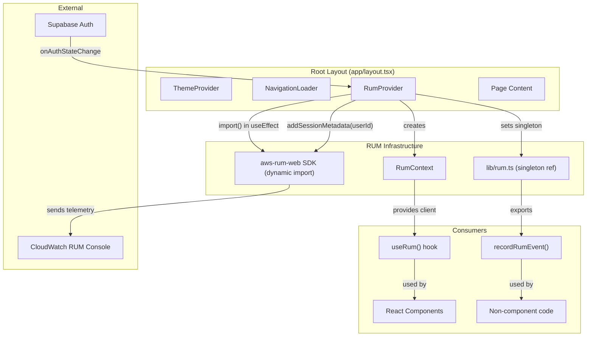

# Design Document: CloudWatch RUM Integration

## Overview

This design integrates Amazon CloudWatch RUM into the Notes9 Next.js 16 application. The integration follows the existing provider pattern used by `ThemeProvider` and `NavigationLoader` in the root layout (`app/layout.tsx`). A new `RumProvider` client component will be added to the root layout's `<body>`, dynamically importing the `aws-rum-web` SDK post-mount to avoid bundle bloat. A React Context + hook (`useRum`) and a standalone utility (`lib/rum.ts`) provide two complementary APIs for recording custom events — one for React components, one for non-component code. Supabase auth state is observed to attach the user UUID as session metadata.

The design prioritizes:
- Zero impact on existing functionality (all RUM code is wrapped in try-catch)
- Minimal bundle impact (dynamic import, post-mount initialization)
- Simple developer ergonomics (one hook, one standalone function)

## Architecture



### Key Architectural Decisions

1. **Single provider in root layout**: The `RumProvider` wraps all routes (app, marketing, auth, legal) from `app/layout.tsx`, matching the pattern of `ThemeProvider`. This ensures page views are tracked across all route groups without duplicating providers.

2. **Dual API surface (hook + standalone function)**: React components use `useRum()` for context-based access. Non-component code (utility functions, event handlers outside React tree) uses `recordRumEvent()` from `lib/rum.ts`, which holds a module-level singleton reference to the RUM client.

3. **Dynamic import with post-mount init**: The `aws-rum-web` package is loaded via `import()` inside a `useEffect`, so it's code-split into its own chunk and never blocks SSR or initial render.

4. **Supabase auth observation inside RumProvider**: The provider subscribes to `supabase.auth.onAuthStateChange` to set/clear user metadata on the RUM session. This keeps auth coupling contained to one component.

## Components and Interfaces

### 1. `RumProvider` (component)

**File**: `components/rum-provider.tsx`

```typescript
"use client"

interface RumContextValue {
  client: AwsRum | null
  recordEvent: (type: string, data: Record<string, unknown>) => void
}
```

- Rendered in `app/layout.tsx` inside `<body>`, alongside `ThemeProvider` and `NavigationLoader`
- On mount (`useEffect`):
  1. Checks that `NEXT_PUBLIC_CW_RUM_APP_ID` is set (skips if missing)
  2. In development (`NODE_ENV === 'development'`), skips unless app ID is explicitly set
  3. Dynamically imports `aws-rum-web`
  4. Constructs `AwsRum` with config from env vars
  5. Stores instance in React Context and in the `lib/rum.ts` singleton
- Subscribes to `supabase.auth.onAuthStateChange`:
  - On `SIGNED_IN` / `TOKEN_REFRESHED`: calls `client.addSessionMetadata({ userId: user.id })`
  - On `SIGNED_OUT`: no action needed (RUM session resets naturally; new session won't carry old metadata)
- All operations wrapped in try-catch; errors logged to `console.warn`

### 2. `useRum` (hook)

**File**: `hooks/use-rum.ts`

```typescript
export function useRum(): {
  client: AwsRum | null
  recordEvent: (type: string, data: Record<string, unknown>) => void
}
```

- Reads from `RumContext`
- `recordEvent` wraps `client.recordEvent()` in try-catch, no-ops if client is null
- Exposes raw `client` for advanced use cases (e.g., custom session attributes)

### 3. `recordRumEvent` (standalone utility)

**File**: `lib/rum.ts`

```typescript
// Module-level singleton, set by RumProvider on init
let rumClient: AwsRum | null = null

export function setRumClient(client: AwsRum | null): void
export function getRumClient(): AwsRum | null
export function recordRumEvent(type: string, data: Record<string, unknown>): void
```

- `recordRumEvent` wraps the singleton's `recordEvent` in try-catch
- No-ops silently when client is null
- Usable from any module without React Context dependency

### 4. Root Layout Integration

**File**: `app/layout.tsx` (modified)

The `RumProvider` is added inside `<body>`, after `ThemeProvider` and before children:

```tsx
<ThemeProvider ...>
  <RumProvider>
    <NavigationLoader />
    {children}
    <Toaster />
    <Sonner />
  </RumProvider>
</ThemeProvider>
```

`RumProvider` renders `{children}` directly — it never blocks rendering.

### 5. Custom Event Integration Points

Events are recorded by adding `recordRumEvent()` or `useRum().recordEvent()` calls at existing action points. No new components are created for this — just function calls added to existing handlers.

| Event Type | Location | Data |
|---|---|---|
| `experiment_created` | Experiment creation handler | `{ projectId }` |
| `report_generated` | Report generation dialog | `{ projectId, reportType }` |
| `project_created` | Project creation handler | `{}` |
| `catalyst_message_sent` | Catalyst chat input | `{}` |
| `lab_note_created` | Lab note creation handler | `{ experimentId }` |
| `protocol_created` | Protocol creation handler | `{}` |
| `research_map_viewed` | Research map page mount | `{}` |
| `user_logged_in` | Auth callback route | `{}` |
| `user_signed_up` | Auth callback route | `{}` |

## Data Models

### RUM Configuration (Environment Variables)

| Variable | Required | Default | Description |
|---|---|---|---|
| `NEXT_PUBLIC_CW_RUM_APP_ID` | Yes (to enable) | — | CloudWatch RUM application monitor ID |
| `NEXT_PUBLIC_CW_RUM_IDENTITY_POOL_ID` | Yes (to enable) | — | Cognito Identity Pool for unauthenticated RUM access |
| `NEXT_PUBLIC_CW_RUM_ENDPOINT` | Yes (to enable) | — | RUM data plane endpoint URL |
| `NEXT_PUBLIC_CW_RUM_REGION` | No | `us-east-1` | AWS region for the RUM application |

### RUM Client Configuration Object

Passed to the `AwsRum` constructor:

```typescript
{
  sessionSampleRate: 1,          // 100% sampling
  identityPoolId: string,        // from env
  endpoint: string,              // from env
  telemetries: ['performance', 'errors', 'http'],
  allowCookies: true,
  enableXRay: false,
}
```

### Custom Event Payload Shapes

```typescript
// All event data objects are Record<string, unknown>
// Specific shapes per event:

type ExperimentCreatedEvent = { projectId: string }
type ReportGeneratedEvent = { projectId: string; reportType: string }
type LabNoteCreatedEvent = { experimentId: string }
// project_created, catalyst_message_sent, protocol_created,
// research_map_viewed, user_logged_in, user_signed_up: {}
```

### Session Metadata

```typescript
// Set via client.addSessionMetadata()
{ userId: string }  // Supabase user UUID only — no PII
```


## Correctness Properties

*A property is a characteristic or behavior that should hold true across all valid executions of a system — essentially, a formal statement about what the system should do. Properties serve as the bridge between human-readable specifications and machine-verifiable correctness guarantees.*

### Property 1: RUM config correctness

*For any* valid set of RUM environment variables (app ID, identity pool ID, endpoint, region), the configuration object passed to the `AwsRum` constructor SHALL include `sessionSampleRate: 1`, telemetries containing `'performance'`, `'errors'`, and `'http'`, and the identity pool ID and endpoint from the provided env vars. When region is not set, it SHALL default to `'us-east-1'`.

**Validates: Requirements 1.1, 1.4, 1.5, 1.6, 1.7, 2.3**

### Property 2: Missing config skips initialization

*For any* subset of the required environment variables (`NEXT_PUBLIC_CW_RUM_APP_ID`, `NEXT_PUBLIC_CW_RUM_IDENTITY_POOL_ID`, `NEXT_PUBLIC_CW_RUM_ENDPOINT`) where at least one is missing or empty, the `buildRumConfig` function SHALL return `null`, indicating initialization should be skipped.

**Validates: Requirements 1.3, 2.2, 2.4**

### Property 3: No-op when RUM is disabled

*For any* event type string and event data object, calling `recordRumEvent` (standalone) or the hook's `recordEvent` when the RUM client is `null` SHALL NOT throw an error and SHALL return without side effects.

**Validates: Requirements 3.2, 3.4**

### Property 4: recordEvent error resilience

*For any* event type string and event data object, if the underlying `client.recordEvent()` throws an error, the wrapper functions (`recordRumEvent` in `lib/rum.ts` and `recordEvent` from `useRum`) SHALL catch the error and NOT propagate it to the caller.

**Validates: Requirements 7.2, 7.3**

### Property 5: Custom event payload completeness

*For any* project ID, report type, and experiment ID, the custom event payloads for `experiment_created`, `report_generated`, and `lab_note_created` SHALL include the specified metadata fields (`projectId` for experiments and reports, `reportType` for reports, `experimentId` for lab notes) in the event data object passed to `recordEvent`.

**Validates: Requirements 5.1, 5.2, 5.5**

### Property 6: Session metadata contains only user UUID

*For any* Supabase user object (containing `id`, `email`, `user_metadata`, `app_metadata`, and other fields), the session metadata passed to `addSessionMetadata` SHALL contain only the `userId` field set to `user.id`, and SHALL NOT include email, name, or any other personally identifiable information.

**Validates: Requirements 8.1, 8.3**

### Property 7: Initialization error resilience

*For any* error thrown during the `aws-rum-web` dynamic import or the `AwsRum` constructor, the `RumProvider` SHALL catch the error and the RUM client SHALL remain `null`, allowing the application to continue functioning without RUM.

**Validates: Requirements 1.8, 7.1**

### Property 8: Children render regardless of RUM state

*For any* RUM initialization state (pending, succeeded, failed, disabled), the `RumProvider` SHALL render its children immediately without blocking or delaying.

**Validates: Requirements 6.3, 7.4**

## Error Handling

All error handling follows a single principle: RUM failures are invisible to the user and never break the application.

| Scenario | Handling | User Impact |
|---|---|---|
| Missing env vars | Skip init, `console.warn` | None — app works without RUM |
| `import('aws-rum-web')` fails | Catch, `console.warn`, client stays `null` | None |
| `new AwsRum()` constructor throws | Catch, `console.warn`, client stays `null` | None |
| `client.recordEvent()` throws | Catch in wrapper, `console.warn` | None — event silently dropped |
| `client.addSessionMetadata()` throws | Catch, `console.warn` | None — session lacks user ID |
| Supabase `onAuthStateChange` errors | Catch in callback, `console.warn` | None — metadata not set |
| `NODE_ENV === 'development'` without app ID | Skip init silently | None — expected dev behavior |

The `console.warn` calls use a `[RUM]` prefix for easy filtering in browser DevTools.

## Testing Strategy

### Property-Based Testing

Property-based tests use `fast-check` (already in devDependencies) with `vitest`. Each property test runs a minimum of 100 iterations.

Tests are located in `__tests__/properties/cloudwatch-rum-integration.property.test.ts`.

The testable properties map to the following test structure:

| Property | Test Approach |
|---|---|
| P1: RUM config correctness | Extract `buildRumConfig` as a pure function. Generate random valid env var sets, verify output config shape. |
| P2: Missing config skips init | Generate all possible subsets of env vars with at least one missing. Verify `buildRumConfig` returns `null`. |
| P3: No-op when disabled | Generate random event types and data objects. Call `recordRumEvent(type, data)` with null client. Assert no throw. |
| P4: recordEvent error resilience | Mock `client.recordEvent` to throw random errors. Call wrapper. Assert no throw. |
| P5: Custom event payload completeness | Generate random IDs. Build event payloads. Verify required fields present. |
| P6: Session metadata UUID only | Generate random user objects with PII fields. Run metadata extraction. Verify only `userId` present. |
| P7: Init error resilience | Test `initializeRum` with a mock that throws random errors. Verify it returns `null`. |
| P8: Children render regardless | Covered by unit tests (React rendering tests). |

Each test is tagged with: `Feature: cloudwatch-rum-integration, Property {N}: {title}`

### Unit Testing

Unit tests are located in `__tests__/unit/cloudwatch-rum-integration.test.ts` and cover:

- `RumProvider` renders children when RUM is disabled (no env vars)
- `RumProvider` renders children when RUM init fails
- `useRum` returns null client when outside provider
- `recordRumEvent` is callable before provider mounts (no-op)
- Custom event type constants match expected strings
- Specific example events (e.g., `project_created` with empty data, `user_logged_in`)
- Logout clears session metadata (example from Req 8.2)

### Testing Configuration

- Library: `fast-check` ^4.7.0 (already installed)
- Runner: `vitest` ^4.1.4 (already installed)
- Environment: `jsdom` (already configured in `vitest.config.ts`)
- Minimum iterations: 100 per property test
- Each property test references its design document property number in a comment tag

### Key Design Decision: Pure Function Extraction

To make properties testable without mounting React components, the core logic is extracted into pure functions:

- `buildRumConfig(env: Partial<RumEnvVars>): RumConfig | null` — pure config builder
- `extractSessionMetadata(user: SupabaseUser): Record<string, string>` — pure metadata extractor
- `recordRumEvent(type, data)` — standalone function testable without React

This keeps property tests fast and deterministic while the unit tests cover React integration.
