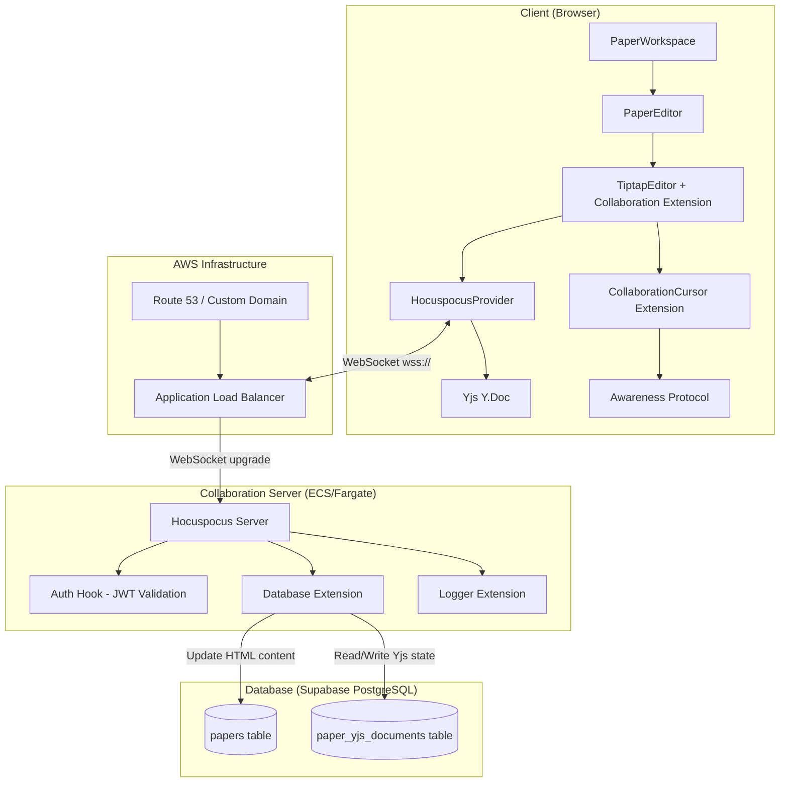

# Design Document: Collaborative Editing

## Overview

This design adds real-time collaborative editing to the existing TipTap-based paper editor. The solution uses a **Yjs CRDT** layer for conflict-free concurrent editing, a **Hocuspocus WebSocket server** for document synchronization and persistence, and integrates with the existing **Supabase** authentication and PostgreSQL database.

The architecture follows a hub-and-spoke model: all clients connect to a central Hocuspocus server which acts as the authoritative sync relay and persistence layer. The existing client-side auto-save mechanism is replaced by server-side persistence when collaboration is active, with graceful fallback to the current behavior when the collaboration server is unavailable.

### Key Design Decisions

1. **Hocuspocus over custom WebSocket**: Hocuspocus provides battle-tested Yjs synchronization, awareness protocol handling, authentication hooks, and database persistence out of the box. Building this from scratch would be error-prone and time-consuming.

2. **Separate server process**: The Hocuspocus server runs as a standalone Node.js service (deployed on AWS ECS/Fargate) rather than embedded in Next.js API routes. WebSocket connections are long-lived and stateful — they don't fit the serverless/edge model of Next.js.

3. **Binary Yjs state + HTML dual storage**: The Yjs binary state is the source of truth for collaborative documents. An HTML rendering is maintained in parallel so existing features (AI tools, export, search) continue working without modification.

4. **Feature-flag via environment variable**: Collaboration is enabled only when `NEXT_PUBLIC_COLLABORATION_URL` is set. This allows gradual rollout and ensures the app works without the collaboration server.

## Architecture



### Connection Flow

1. User opens a paper → `PaperWorkspace` loads paper metadata from Supabase
2. If `NEXT_PUBLIC_COLLABORATION_URL` is set, `PaperEditor` creates a `HocuspocusProvider` with the paper ID as document name
3. Provider sends WebSocket connection request with Supabase JWT token
4. Hocuspocus server validates JWT via the `onAuthenticate` hook
5. Server loads Yjs document state from `paper_yjs_documents` (or creates from HTML if first time)
6. Client receives document state, TipTap renders it
7. Edits flow bidirectionally through the WebSocket as Yjs updates
8. Server persists document state on changes (debounced) and on document close

## Components and Interfaces

### 1. Collaboration Server (`collaboration-server/`)

A standalone Node.js application using `@hocuspocus/server`.

```typescript
// collaboration-server/src/index.ts
interface ServerConfig {
  port: number;                    // Default: 8080
  databaseUrl: string;             // Supabase PostgreSQL connection string
  jwtSecret: string;               // Supabase JWT secret for token validation
  allowedOrigins: string[];        // CORS origins (e.g., ["https://app.notes9.com"])
}
```

**Directory structure:**
```
collaboration-server/
├── src/
│   ├── index.ts              # Server entry point
│   ├── auth.ts               # JWT validation logic
│   ├── database.ts           # Database extension (load/store Yjs docs)
│   ├── html-renderer.ts      # Yjs → HTML conversion for papers.content sync
│   └── health.ts             # Health check HTTP endpoint
├── Dockerfile
├── package.json
├── tsconfig.json
└── .env.example
```

**Server lifecycle hooks:**

| Hook | Purpose |
|------|---------|
| `onAuthenticate` | Validate Supabase JWT, extract user info |
| `onLoadDocument` | Load Yjs binary from DB, or create from HTML on first connection |
| `onStoreDocument` | Persist Yjs binary + render HTML to `papers.content` |
| `onDisconnect` | Clean up awareness state |

### 2. Client-Side Provider Hook (`lib/collaboration/use-collaboration.ts`)

```typescript
interface UseCollaborationOptions {
  paperId: string;
  enabled: boolean;              // false when NEXT_PUBLIC_COLLABORATION_URL is not set
}

interface UseCollaborationReturn {
  provider: HocuspocusProvider | null;
  ydoc: Y.Doc | null;
  status: 'connecting' | 'connected' | 'disconnected';
  collaborators: CollaboratorInfo[];
  error: string | null;
}

interface CollaboratorInfo {
  userId: string;
  name: string;
  color: string;
  cursor: { anchor: number; head: number } | null;
}
```

### 3. Collaboration-Aware Editor Configuration

The `PaperEditor` component conditionally configures TipTap extensions based on collaboration mode:

```typescript
// When collaboration is active:
const extensions = [
  StarterKit.configure({
    history: false,  // Disable built-in undo/redo
    // ... other config
  }),
  Collaboration.configure({
    document: ydoc,
    field: 'default',
  }),
  CollaborationCursor.configure({
    provider: hocuspocusProvider,
    user: { name: userName, color: userColor },
  }),
  // ... all other existing extensions unchanged
];

// When collaboration is NOT active:
const extensions = [
  StarterKit.configure({
    // history enabled (default)
  }),
  // ... all other existing extensions unchanged
];
```

### 4. Active Collaborators Display (`components/collaboration/collaborator-avatars.tsx`)

```typescript
interface CollaboratorAvatarsProps {
  collaborators: CollaboratorInfo[];
  maxVisible?: number;  // Default: 5
}
```

Renders a horizontal stack of avatar circles in the paper header, each with the collaborator's assigned color as a border. Shows a "+N" overflow indicator when more than `maxVisible` collaborators are present.

### 5. Connection Status Indicator (`components/collaboration/connection-status.tsx`)

```typescript
interface ConnectionStatusProps {
  status: 'connecting' | 'connected' | 'disconnected';
}
```

A small indicator next to the existing `SaveStatusIndicator` showing:
- 🟢 Connected (green dot, tooltip: "Collaboration active")
- 🟡 Connecting/Reconnecting (yellow dot with pulse, tooltip: "Reconnecting...")
- 🔴 Disconnected (red dot, tooltip: "Collaboration unavailable")

### 6. Color Assignment Utility (`lib/collaboration/colors.ts`)

```typescript
const COLLABORATOR_COLORS = [
  '#F44336', '#E91E63', '#9C27B0', '#673AB7',
  '#3F51B5', '#2196F3', '#00BCD4', '#009688',
  '#4CAF50', '#FF9800', '#FF5722', '#795548',
] as const;

function getCollaboratorColor(userId: string): string;
```

Deterministically assigns a color based on a hash of the user ID, ensuring the same user always gets the same color across sessions.

## Data Models

### New Table: `paper_yjs_documents`

```sql
CREATE TABLE paper_yjs_documents (
  paper_id UUID PRIMARY KEY REFERENCES papers(id) ON DELETE CASCADE,
  yjs_state BYTEA NOT NULL,           -- Binary Yjs document state (Y.encodeStateAsUpdate)
  created_at TIMESTAMPTZ NOT NULL DEFAULT NOW(),
  updated_at TIMESTAMPTZ NOT NULL DEFAULT NOW()
);

-- Index for quick lookups by the collaboration server
CREATE INDEX idx_paper_yjs_documents_updated_at ON paper_yjs_documents(updated_at);
```

### Existing Table Modifications: `papers`

No schema changes required. The existing `content` (text) and `updated_at` (timestamptz) columns are reused:
- `content`: Updated by the collaboration server with rendered HTML on each persist
- `updated_at`: Updated by the collaboration server on each persist

### Environment Variables

| Variable | Location | Purpose |
|----------|----------|---------|
| `NEXT_PUBLIC_COLLABORATION_URL` | Next.js client | WebSocket URL (e.g., `wss://collab.notes9.com`) |
| `DATABASE_URL` | Collaboration server | PostgreSQL connection string |
| `JWT_SECRET` | Collaboration server | Supabase JWT secret for token validation |
| `PORT` | Collaboration server | HTTP/WebSocket port (default: 8080) |
| `ALLOWED_ORIGINS` | Collaboration server | Comma-separated CORS origins |

## Correctness Properties

*A property is a characteristic or behavior that should hold true across all valid executions of a system — essentially, a formal statement about what the system should do. Properties serve as the bridge between human-readable specifications and machine-verifiable correctness guarantees.*

### Property 1: JWT Authentication Correctness

*For any* JWT string, the authentication hook SHALL accept the token if and only if it has a valid signature matching the configured JWT secret AND is not expired. Invalid, expired, or malformed tokens SHALL be rejected.

**Validates: Requirements 1.3, 1.4, 1.5**

### Property 2: CRDT Merge Preserves All Edits

*For any* two sequences of text edits applied independently to two Y.Doc copies of the same initial state, merging both update sets into either document SHALL produce a final document containing all characters inserted by both edit sequences (no data loss).

**Validates: Requirements 2.4, 2.5**

### Property 3: Deterministic Color Assignment

*For any* user ID string, `getCollaboratorColor(userId)` SHALL always return the same color from the predefined palette, and that color SHALL be used consistently for both the cursor indicator and the avatar border.

**Validates: Requirements 3.5, 9.5**

### Property 4: HTML-to-Yjs Round Trip Preserves Content

*For any* valid HTML paper content, converting it to a Yjs document state and then rendering that Yjs state back to HTML SHALL produce output that preserves the text content and structural elements (headings, paragraphs, lists, tables) of the original.

**Validates: Requirements 7.1, 4.5**

### Property 5: History Extension Toggled by Collaboration State

*For any* editor configuration, if collaboration mode is active then the TipTap `history` extension SHALL be disabled (not present in the extension list), and if collaboration mode is inactive then the `history` extension SHALL be enabled.

**Validates: Requirements 8.3, 8.5**

### Property 6: Connection Status Indicator Correctness

*For any* connection status value in the set {`connecting`, `connected`, `disconnected`}, the connection status indicator component SHALL render the corresponding visual state (yellow/pulse, green/static, red/static respectively) with no other combinations possible.

**Validates: Requirements 5.4**

### Property 7: Collaborator Avatar Rendering

*For any* list of N collaborators (where N ≥ 0) and a configured `maxVisible` limit, the collaborator avatars component SHALL render exactly `min(N, maxVisible)` avatar elements, plus an overflow indicator showing `N - maxVisible` if and only if N > maxVisible.

**Validates: Requirements 9.1**


## Error Handling

### Client-Side Errors

| Error Scenario | Handling Strategy |
|----------------|-------------------|
| WebSocket connection refused | Show "Collaboration unavailable" status; fall back to single-user mode with client-side auto-save |
| Auth token expired during session | Refresh Supabase token, reconnect provider automatically |
| Provider fails to reconnect (>30s) | Show warning toast; editor remains functional in offline mode; local changes buffered in Y.Doc |
| `NEXT_PUBLIC_COLLABORATION_URL` not set | Skip collaboration setup entirely; use existing single-user editor behavior |
| Malformed awareness data | Ignore invalid awareness updates; log warning; don't crash the editor |

### Server-Side Errors

| Error Scenario | Handling Strategy |
|----------------|-------------------|
| Database connection failure on load | Return error to client; client falls back to loading HTML from Supabase directly |
| Database write failure on persist | Retry with exponential backoff (3 attempts); log error; keep document in memory |
| JWT validation failure | Reject connection with HTTP 401; client shows "Authentication failed" message |
| HTML rendering failure | Log error; persist Yjs binary state anyway; skip HTML update (non-critical) |
| Server out of memory | Hocuspocus unloads idle documents after 30s; configure container memory limits appropriately |
| Unexpected server crash | Clients auto-reconnect; Yjs state is loaded from last persisted snapshot; at most 30s of edits may need re-sync from client buffers |

### Graceful Degradation Strategy

The system operates in three modes with automatic fallback:

1. **Full collaboration** (server available, WebSocket connected): Real-time sync, server-side persistence, presence awareness
2. **Offline buffering** (server temporarily unavailable): Editor remains functional, changes buffered locally in Y.Doc, auto-reconnect with sync
3. **Single-user fallback** (server unreachable or not configured): Standard TipTap editor with client-side auto-save to Supabase, identical to current behavior

## Testing Strategy

### Property-Based Tests (fast-check, minimum 100 iterations each)

Property-based tests validate the correctness properties defined above using the `fast-check` library (already installed as a dev dependency).

| Property | Test File | What's Generated |
|----------|-----------|-----------------|
| P1: JWT Auth | `__tests__/properties/collaborative-editing.property.test.ts` | Random JWT payloads (valid/invalid/expired/malformed) |
| P2: CRDT Merge | Same file | Random edit sequences (inserts, deletes) on Y.Doc pairs |
| P3: Color Assignment | Same file | Random user ID strings |
| P4: HTML Round Trip | Same file | Random HTML structures (headings, paragraphs, lists, tables) |
| P5: History Toggle | Same file | Boolean collaboration state |
| P6: Status Indicator | Same file | Connection status enum values |
| P7: Avatar Rendering | Same file | Random collaborator lists (0-20 items) with varying maxVisible |

Each test is tagged: `Feature: collaborative-editing, Property N: <property_text>`

### Unit Tests (vitest)

| Test | Purpose |
|------|---------|
| `use-collaboration` hook | Verify provider creation, cleanup, status transitions |
| Color assignment | Verify determinism, palette bounds, distribution |
| Connection status component | Verify rendering for each state |
| Collaborator avatars component | Verify avatar count, overflow, tooltips |
| Editor configuration | Verify extension list differs based on collaboration mode |
| Fallback behavior | Verify auto-save enabled/disabled based on collaboration state |

### Integration Tests

| Test | Purpose |
|------|---------|
| Server auth hook | Verify real JWT validation against Supabase secret |
| Document load/store | Verify Yjs binary persistence round-trip through PostgreSQL |
| HTML migration | Verify existing HTML papers load correctly in collaboration mode |
| Multi-client sync | Verify edits from one client appear on another (2 providers, 1 server) |

### Manual Testing Checklist

- [ ] Open same paper in two browser tabs — verify real-time sync
- [ ] Verify cursor positions and names visible across tabs
- [ ] Disconnect network — verify editor remains editable
- [ ] Reconnect network — verify changes sync
- [ ] Open paper with existing HTML content — verify migration works
- [ ] Close all tabs — reopen paper — verify content persisted
- [ ] Verify AI tools, export, and search still work (they read `papers.content`)

## AWS Deployment Guide

This section provides detailed instructions for deploying the Hocuspocus collaboration server on AWS. The user handles infrastructure setup manually; this guide serves as the reference.

### Architecture Overview

```
┌─────────────────────────────────────────────────────────┐
│ AWS VPC                                                  │
│                                                          │
│  ┌──────────────────────────────────────────────────┐   │
│  │ Public Subnet                                     │   │
│  │  ┌─────────────────────────────────────────────┐ │   │
│  │  │ Application Load Balancer (ALB)              │ │   │
│  │  │ - HTTPS/WSS listener on port 443            │ │   │
│  │  │ - TLS termination (ACM certificate)         │ │   │
│  │  │ - Stickiness enabled for WebSocket          │ │   │
│  │  └─────────────────────────────────────────────┘ │   │
│  └──────────────────────────────────────────────────────┘   │
│                                                          │
│  ┌──────────────────────────────────────────────────┐   │
│  │ Private Subnet                                    │   │
│  │  ┌─────────────────────────────────────────────┐ │   │
│  │  │ ECS Fargate Service                         │ │   │
│  │  │ - Task: collaboration-server container      │ │   │
│  │  │ - Port: 8080                                │ │   │
│  │  │ - Health check: GET /health                 │ │   │
│  │  │ - Min 1 / Max 4 tasks (CPU-based scaling)   │ │   │
│  │  └─────────────────────────────────────────────┘ │   │
│  └──────────────────────────────────────────────────────┘   │
│                                                          │
└─────────────────────────────────────────────────────────┘
         │
         │ PostgreSQL connection (port 5432)
         ▼
┌─────────────────────┐
│ Supabase PostgreSQL  │
│ (External)           │
└─────────────────────┘
```

### Step 1: Build and Push Docker Image

```bash
# From the collaboration-server/ directory
docker build -t collaboration-server .

# Tag and push to ECR
aws ecr create-repository --repository-name collaboration-server
aws ecr get-login-password --region us-east-1 | docker login --username AWS --password-stdin <account-id>.dkr.ecr.us-east-1.amazonaws.com
docker tag collaboration-server:latest <account-id>.dkr.ecr.us-east-1.amazonaws.com/collaboration-server:latest
docker push <account-id>.dkr.ecr.us-east-1.amazonaws.com/collaboration-server:latest
```

### Step 2: Create ECS Task Definition

```json
{
  "family": "collaboration-server",
  "networkMode": "awsvpc",
  "requiresCompatibilities": ["FARGATE"],
  "cpu": "512",
  "memory": "1024",
  "executionRoleArn": "arn:aws:iam::<account-id>:role/ecsTaskExecutionRole",
  "containerDefinitions": [
    {
      "name": "collaboration-server",
      "image": "<account-id>.dkr.ecr.us-east-1.amazonaws.com/collaboration-server:latest",
      "portMappings": [
        {
          "containerPort": 8080,
          "protocol": "tcp"
        }
      ],
      "environment": [
        { "name": "PORT", "value": "8080" },
        { "name": "ALLOWED_ORIGINS", "value": "https://app.notes9.com,https://www.notes9.com" }
      ],
      "secrets": [
        {
          "name": "DATABASE_URL",
          "valueFrom": "arn:aws:secretsmanager:us-east-1:<account-id>:secret:collab-server/database-url"
        },
        {
          "name": "JWT_SECRET",
          "valueFrom": "arn:aws:secretsmanager:us-east-1:<account-id>:secret:collab-server/jwt-secret"
        }
      ],
      "healthCheck": {
        "command": ["CMD-SHELL", "curl -f http://localhost:8080/health || exit 1"],
        "interval": 30,
        "timeout": 5,
        "retries": 3,
        "startPeriod": 10
      },
      "logConfiguration": {
        "logDriver": "awslogs",
        "options": {
          "awslogs-group": "/ecs/collaboration-server",
          "awslogs-region": "us-east-1",
          "awslogs-stream-prefix": "ecs"
        }
      }
    }
  ]
}
```

### Step 3: Configure Application Load Balancer

1. **Create Target Group:**
   - Target type: IP
   - Protocol: HTTP
   - Port: 8080
   - Health check path: `/health`
   - Deregistration delay: 300s (allow WebSocket connections to drain)
   - Stickiness: Enabled (required for WebSocket)

2. **Create ALB:**
   - Scheme: Internet-facing
   - Listeners:
     - HTTPS (443) → Target Group
   - Security Group: Allow inbound 443 from anywhere

3. **WebSocket Configuration:**
   - Idle timeout: **3600 seconds** (1 hour) — critical for long-lived WebSocket connections
   - Connection draining: 300 seconds

4. **TLS Certificate:**
   - Request ACM certificate for `collab.notes9.com` (or your domain)
   - Attach to ALB HTTPS listener

### Step 4: Security Groups

| Security Group | Inbound Rules | Outbound Rules |
|----------------|---------------|----------------|
| ALB SG | TCP 443 from 0.0.0.0/0 | TCP 8080 to ECS SG |
| ECS SG | TCP 8080 from ALB SG | TCP 5432 to Supabase IP range, TCP 443 to 0.0.0.0/0 (for health checks) |

### Step 5: Create ECS Service

```bash
aws ecs create-service \
  --cluster collaboration \
  --service-name collaboration-server \
  --task-definition collaboration-server \
  --desired-count 1 \
  --launch-type FARGATE \
  --network-configuration "awsvpcConfiguration={subnets=[subnet-xxx],securityGroups=[sg-xxx],assignPublicIp=DISABLED}" \
  --load-balancers "targetGroupArn=arn:aws:elasticloadbalancing:...,containerName=collaboration-server,containerPort=8080"
```

### Step 6: Auto-Scaling (Optional)

```bash
aws application-autoscaling register-scalable-target \
  --service-namespace ecs \
  --resource-id service/collaboration/collaboration-server \
  --scalable-dimension ecs:service:DesiredCount \
  --min-capacity 1 \
  --max-capacity 4

aws application-autoscaling put-scaling-policy \
  --service-namespace ecs \
  --resource-id service/collaboration/collaboration-server \
  --scalable-dimension ecs:service:DesiredCount \
  --policy-name cpu-scaling \
  --policy-type TargetTrackingScaling \
  --target-tracking-scaling-policy-configuration "TargetValue=70,PredefinedMetricSpecification={PredefinedMetricType=ECSServiceAverageCPUUtilization}"
```

### Step 7: DNS Configuration

Create a CNAME or A-record (alias) pointing `collab.notes9.com` to the ALB DNS name.

### Step 8: Environment Variable in Next.js

Add to your deployment environment:
```
NEXT_PUBLIC_COLLABORATION_URL=wss://collab.notes9.com
```

### Important Notes

- **WebSocket idle timeout**: The ALB idle timeout MUST be set to at least 3600s. The default 60s will kill WebSocket connections.
- **Sticky sessions**: Required if running multiple Fargate tasks, since Hocuspocus keeps document state in memory per instance. For single-instance deployments, this is not strictly necessary.
- **Scaling considerations**: Each Hocuspocus instance holds documents in memory. With multiple instances, the same document could be loaded on different instances. For the initial deployment, a single instance is recommended. For multi-instance, consider adding Redis pub/sub for cross-instance sync (future enhancement).
- **Database connection pooling**: Use Supabase's connection pooler (port 6543, transaction mode) for the `DATABASE_URL` to avoid exhausting connections.
