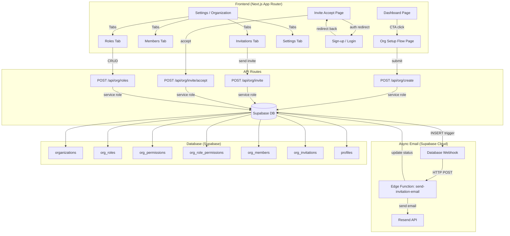
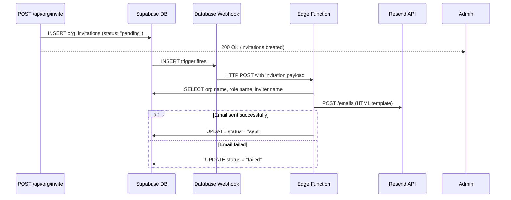
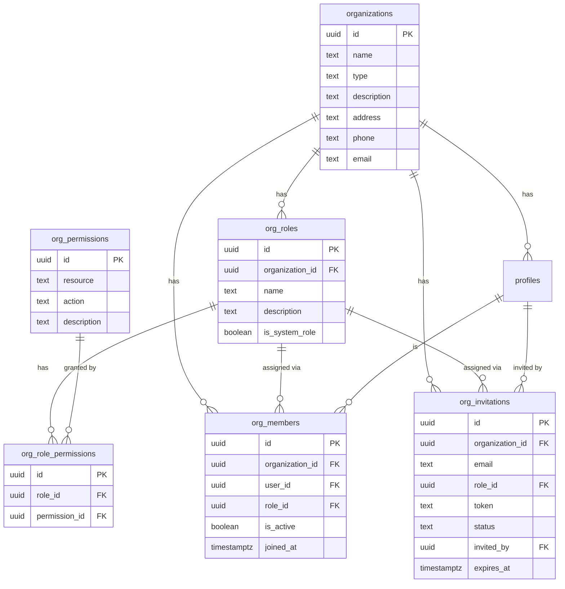

# Design Document: Lab/Organization Management

## Overview

This feature adds a complete organization management system to Notes9, enabling research labs to create organizations, define custom roles with granular permissions, invite team members via email, and administer their lab through a dedicated dashboard. The system extends the existing Supabase schema with new tables (`org_roles`, `org_permissions`, `org_role_permissions`, `org_members`, `org_invitations`) while preserving backward compatibility with the existing `profiles.role` CHECK constraint and RLS policies.

The feature spans four main user flows:
1. Organization setup from the dashboard CTA
2. Role and permission management by admins
3. Member invitation via email (Resend) with token-based acceptance
4. Organization dashboard at `/settings/organization` for centralized administration

## Architecture

The feature follows the existing Next.js App Router patterns with server components for data fetching and client components for interactive forms. Database operations use Supabase with RLS policies enforcing organization-scoped access. Email delivery is decoupled from the request/response cycle using an event-driven architecture: a Postgres trigger on `org_invitations` INSERT fires a Supabase Database Webhook that invokes a Supabase Edge Function to send invitation emails asynchronously via Resend.



### Key Architectural Decisions

1. **API routes with service role key for mutations**: Organization creation, invitation, and role management use API routes with `SUPABASE_SERVICE_ROLE_KEY` to bypass RLS for multi-table transactional operations (e.g., creating org + role + member in one flow). Read operations use the user's session via RLS.

2. **Separate `org_members` table instead of extending `profiles`**: The existing `profiles.organization_id` is kept for backward compatibility but `org_members` becomes the source of truth for membership and role assignment. This allows future multi-org support without schema changes.

3. **Permission-based access control**: Permissions are stored as `(resource, action)` pairs in `org_permissions`, linked to roles via `org_role_permissions`. This is more extensible than hardcoding permissions into role names.

4. **Token-based invitation flow**: Invitations use a cryptographically secure token (UUID v4 + crypto random hex) stored in `org_invitations`. The token is passed through sign-up/login flows as a query parameter.

5. **Async email delivery via Supabase Edge Function**: Email sending is decoupled from the invite API route. When an `org_invitations` row is INSERTed with status "pending", a Supabase Database Webhook fires and invokes a Supabase Edge Function (`send-invitation-email`). The Edge Function calls Resend's API, then updates the invitation's status to "sent" or "failed". This keeps the invite API route fast, makes email delivery resilient to Resend latency/outages, and centralizes email logic in a single function that can be retried independently.

## Components and Interfaces

### Pages and Routes

| Route | Type | Description |
|-------|------|-------------|
| `app/(app)/dashboard/page.tsx` | Server Component (modified) | Add org setup CTA card above Quick Actions |
| `app/(app)/org/setup/page.tsx` | Client Component (new) | Multi-field org creation form |
| `app/(app)/settings/organization/page.tsx` | Client Component (new) | Org dashboard with tabs: Members, Roles, Invitations, Settings |
| `app/auth/invite/page.tsx` | Client Component (new) | Invitation acceptance page |
| `app/api/org/create/route.ts` | API Route (new) | Create org + default admin role + member record |
| `app/api/org/invite/route.ts` | API Route (new) | Create invitation records (email sent async via Edge Function) |
| `app/api/org/invite/accept/route.ts` | API Route (new) | Accept invitation, update profile + create member |
| `app/api/org/roles/route.ts` | API Route (new) | CRUD for org roles and permissions |
| `app/api/org/members/route.ts` | API Route (new) | Remove/deactivate members |

### Shared Components

| Component | Location | Description |
|-----------|----------|-------------|
| `OrgSetupCTA` | `components/org/org-setup-cta.tsx` | Dashboard CTA card for org setup |
| `OrgSetupForm` | `components/org/org-setup-form.tsx` | Organization creation form |
| `MembersTable` | `components/org/members-table.tsx` | Table of org members with role and actions |
| `RolesManager` | `components/org/roles-manager.tsx` | Role list + create/edit role dialog |
| `PermissionGrid` | `components/org/permission-grid.tsx` | Checkbox grid of resource × action permissions |
| `InvitationsTable` | `components/org/invitations-table.tsx` | Pending/sent invitations with revoke action |
| `InviteDialog` | `components/org/invite-dialog.tsx` | Dialog to enter emails + select role |
| `OrgSettingsForm` | `components/org/org-settings-form.tsx` | Edit org name, type, description, contact info |

### API Route Interfaces

#### POST `/api/org/create`

```typescript
// Request
{
  name: string           // 2-100 chars, required
  type?: string          // "academic" | "industry" | "government" | "independent"
  description?: string
  address?: string
  phone?: string
  email?: string
}

// Response 200
{
  organization: { id: string; name: string }
  role: { id: string; name: string }
  member: { id: string }
}

// Response 400 - validation error
// Response 500 - database error
```

#### POST `/api/org/invite`

```typescript
// Request
{
  emails: string[]       // 1+ valid email addresses
  roleId: string         // UUID of org_roles record
}

// Response 200 — invitations created, emails will be sent asynchronously
{
  invitations: Array<{
    id: string
    email: string
    status: "pending"    // always "pending" — email delivery is async
  }>
}
```

### Supabase Edge Function: `send-invitation-email`

This Deno-based Edge Function runs in Supabase Cloud and is triggered by a Database Webhook on `org_invitations` INSERT events.

Location: `supabase/functions/send-invitation-email/index.ts`



```typescript
// supabase/functions/send-invitation-email/index.ts
import { serve } from "https://deno.land/std/http/server.ts"
import { createClient } from "https://esm.sh/@supabase/supabase-js"

interface WebhookPayload {
  type: "INSERT"
  table: "org_invitations"
  record: {
    id: string
    organization_id: string
    email: string
    role_id: string
    token: string
    status: string
    invited_by: string
  }
}

serve(async (req: Request) => {
  const payload: WebhookPayload = await req.json()
  const { record } = payload

  // Only process pending invitations
  if (record.status !== "pending") {
    return new Response("Skipped: not pending", { status: 200 })
  }

  const supabase = createClient(
    Deno.env.get("SUPABASE_URL")!,
    Deno.env.get("SUPABASE_SERVICE_ROLE_KEY")!
  )

  // Fetch org name, role name, inviter name
  const [{ data: org }, { data: role }, { data: inviter }] = await Promise.all([
    supabase.from("organizations").select("name").eq("id", record.organization_id).single(),
    supabase.from("org_roles").select("name").eq("id", record.role_id).single(),
    supabase.from("profiles").select("first_name, last_name").eq("id", record.invited_by).single(),
  ])

  const appUrl = Deno.env.get("APP_URL") || "https://notes9.com"
  const inviteUrl = `${appUrl}/auth/invite?token=${record.token}`
  const fromEmail = Deno.env.get("RESEND_FROM_EMAIL") || "Notes9 <no-reply@notes9.com>"

  // Send email via Resend REST API
  const resendRes = await fetch("https://api.resend.com/emails", {
    method: "POST",
    headers: {
      "Authorization": `Bearer ${Deno.env.get("RESEND_API_KEY")}`,
      "Content-Type": "application/json",
    },
    body: JSON.stringify({
      from: fromEmail,
      to: [record.email],
      subject: `You're invited to join ${org?.name} on Notes9`,
      html: buildInvitationEmailHtml({
        orgName: org?.name || "a lab",
        roleName: role?.name || "Member",
        inviterName: inviter ? `${inviter.first_name} ${inviter.last_name}`.trim() : "A colleague",
        inviteUrl,
      }),
    }),
  })

  // Update invitation status based on result
  const newStatus = resendRes.ok ? "sent" : "failed"
  await supabase
    .from("org_invitations")
    .update({ status: newStatus })
    .eq("id", record.id)

  return new Response(JSON.stringify({ status: newStatus }), { status: 200 })
})

function buildInvitationEmailHtml(params: {
  orgName: string
  roleName: string
  inviterName: string
  inviteUrl: string
}): string {
  // Returns responsive HTML email template
  // (implementation in tasks phase)
}
```

Edge Function environment variables (set via Supabase Dashboard or CLI):
- `SUPABASE_URL` — auto-provided by Supabase
- `SUPABASE_SERVICE_ROLE_KEY` — auto-provided by Supabase
- `RESEND_API_KEY` — your Resend API key
- `RESEND_FROM_EMAIL` — verified sender address (e.g., `Notes9 <no-reply@notes9.com>`)
- `APP_URL` — your app's base URL (e.g., `https://notes9.com`)

Database Webhook configuration (via Supabase Dashboard or migration):
- Table: `org_invitations`
- Events: `INSERT`
- Type: Supabase Edge Function
- Function: `send-invitation-email`

#### POST `/api/org/invite/accept`

```typescript
// Request
{
  token: string          // invitation token
}

// Response 200
{
  organizationId: string
  roleName: string
}

// Response 400 - invalid/expired token
// Response 409 - user already in another org
```

#### POST/PUT/DELETE `/api/org/roles`

```typescript
// POST - Create role
{
  name: string
  description?: string
  permissionIds: string[]  // array of org_permissions UUIDs
}

// PUT - Update role
{
  roleId: string
  name?: string
  description?: string
  permissionIds?: string[]
}

// DELETE - Delete role
{
  roleId: string
}
```


### Utility Functions

```typescript
// lib/org/permissions.ts
export const RESOURCES = [
  "projects", "experiments", "samples",
  "equipment", "protocols", "lab_notes", "reports"
] as const

export const ACTIONS = ["view", "create", "edit", "delete"] as const

export type Resource = typeof RESOURCES[number]
export type Action = typeof ACTIONS[number]
export type PermissionKey = `${Resource}.${Action}`

export function hasPermission(
  userPermissions: PermissionKey[],
  resource: Resource,
  action: Action
): boolean

export function isOrgAdmin(
  orgMembers: OrgMember[],
  userId: string
): boolean
```

```typescript
// lib/org/invitation.ts
import { randomBytes } from "crypto"

export function generateInvitationToken(): string {
  return randomBytes(32).toString("hex")
}

export function buildInvitationUrl(token: string): string {
  const base = process.env.NEXT_PUBLIC_APP_URL || "http://localhost:3000"
  return `${base}/auth/invite?token=${token}`
}
```

## Data Models

### New Tables

#### `org_roles`

| Column | Type | Constraints | Description |
|--------|------|-------------|-------------|
| id | UUID | PK, default uuid_generate_v4() | Role identifier |
| organization_id | UUID | FK → organizations(id) ON DELETE CASCADE | Owning organization |
| name | TEXT | NOT NULL | Role display name |
| description | TEXT | | Optional description |
| is_system_role | BOOLEAN | DEFAULT false | True for auto-created "Admin" role |
| created_at | TIMESTAMPTZ | DEFAULT NOW() | |
| updated_at | TIMESTAMPTZ | DEFAULT NOW() | |

UNIQUE constraint on (`organization_id`, `name`).

#### `org_permissions`

| Column | Type | Constraints | Description |
|--------|------|-------------|-------------|
| id | UUID | PK, default uuid_generate_v4() | Permission identifier |
| resource | TEXT | NOT NULL | Resource name (e.g., "projects") |
| action | TEXT | NOT NULL | Action name (e.g., "create") |
| description | TEXT | | Human-readable description |

UNIQUE constraint on (`resource`, `action`). Seeded with 7 resources × 4 actions = 28 rows.

#### `org_role_permissions`

| Column | Type | Constraints | Description |
|--------|------|-------------|-------------|
| id | UUID | PK, default uuid_generate_v4() | |
| role_id | UUID | FK → org_roles(id) ON DELETE CASCADE | |
| permission_id | UUID | FK → org_permissions(id) ON DELETE CASCADE | |

UNIQUE constraint on (`role_id`, `permission_id`).

#### `org_members`

| Column | Type | Constraints | Description |
|--------|------|-------------|-------------|
| id | UUID | PK, default uuid_generate_v4() | |
| organization_id | UUID | FK → organizations(id) ON DELETE CASCADE | |
| user_id | UUID | FK → profiles(id) ON DELETE CASCADE | |
| role_id | UUID | FK → org_roles(id) ON DELETE SET NULL | |
| is_active | BOOLEAN | DEFAULT true | Soft-delete for removed members |
| joined_at | TIMESTAMPTZ | DEFAULT NOW() | |

UNIQUE constraint on (`organization_id`, `user_id`).

#### `org_invitations`

| Column | Type | Constraints | Description |
|--------|------|-------------|-------------|
| id | UUID | PK, default uuid_generate_v4() | |
| organization_id | UUID | FK → organizations(id) ON DELETE CASCADE | |
| email | TEXT | NOT NULL | Invitee email |
| role_id | UUID | FK → org_roles(id) ON DELETE SET NULL | Assigned role |
| token | TEXT | UNIQUE, NOT NULL | Secure acceptance token |
| status | TEXT | CHECK (pending/sent/accepted/revoked/expired/failed) | |
| invited_by | UUID | FK → profiles(id) ON DELETE SET NULL | Admin who sent invite |
| created_at | TIMESTAMPTZ | DEFAULT NOW() | |
| expires_at | TIMESTAMPTZ | | Token expiration (default 7 days) |

### Modified Tables

#### `organizations` (add columns)

| Column | Type | Description |
|--------|------|-------------|
| type | TEXT | "academic", "industry", "government", "independent" |
| description | TEXT | Organization description |

### Entity Relationship Diagram



### Seed Data: `org_permissions`

The migration seeds 28 permission records:

| Resource | Actions |
|----------|---------|
| projects | view, create, edit, delete |
| experiments | view, create, edit, delete |
| samples | view, create, edit, delete |
| equipment | view, create, edit, delete |
| protocols | view, create, edit, delete |
| lab_notes | view, create, edit, delete |
| reports | view, create, edit, delete |

### Migration File

File: `supabase/migrations/20260520_org_management.sql`

The migration:
1. Adds `type` and `description` columns to `organizations`
2. Creates `org_permissions` table and seeds 28 rows
3. Creates `org_roles` table with unique constraint
4. Creates `org_role_permissions` join table
5. Creates `org_members` table with unique constraint
6. Creates `org_invitations` table (status CHECK includes: pending, sent, accepted, revoked, expired, failed)
7. Creates indexes on all FK columns
8. Creates RLS policies for all new tables
9. Applies `update_updated_at_column()` trigger to `org_roles`
10. Configures Database Webhook on `org_invitations` INSERT to invoke the `send-invitation-email` Edge Function

### Supabase Edge Function Deployment

File: `supabase/functions/send-invitation-email/index.ts`

Deployed via Supabase CLI:
```bash
supabase functions deploy send-invitation-email
```

Environment secrets set via:
```bash
supabase secrets set RESEND_API_KEY=re_xxxxx
supabase secrets set RESEND_FROM_EMAIL="Notes9 <no-reply@notes9.com>"
supabase secrets set APP_URL=https://notes9.com
```


## Correctness Properties

*A property is a characteristic or behavior that should hold true across all valid executions of a system — essentially, a formal statement about what the system should do. Properties serve as the bridge between human-readable specifications and machine-verifiable correctness guarantees.*

### Property 1: CTA visibility is determined by organization_id presence

*For any* user profile, the "Use Notes9 for my lab" CTA card is visible if and only if `organization_id` is null. When `organization_id` is non-null, the CTA is hidden.

**Validates: Requirements 1.1, 1.2**

### Property 2: Organization creation transaction integrity

*For any* valid organization creation request (name 2-100 chars), the resulting state must include: (a) a new `organizations` record with the provided details, (b) the creator's `profiles.organization_id` set to the new org's id, (c) an `org_roles` record named "Admin" with `is_system_role = true` and all 28 permissions linked via `org_role_permissions`, and (d) an `org_members` record linking the creator to the org with the Admin role.

**Validates: Requirements 2.3, 2.4, 2.5, 2.6**

### Property 3: Organization name validation

*For any* string, the organization name validation accepts it if and only if its trimmed length is between 2 and 100 characters inclusive. Strings outside this range are rejected.

**Validates: Requirements 2.9**

### Property 4: Permission grouping by resource

*For any* set of permissions, grouping by resource produces groups where every permission in a group has the same `resource` value, and the number of groups equals the number of distinct resources in the input set.

**Validates: Requirements 3.3**

### Property 5: Role creation produces correct records

*For any* valid role name (unique within the org) and non-empty set of permission IDs, creating a role produces one `org_roles` record and exactly N `org_role_permissions` records where N equals the number of selected permissions. Updating a role replaces its permission set to match the new selection.

**Validates: Requirements 3.4, 3.5**

### Property 6: System role protection

*For any* role where `is_system_role` is true, delete and edit operations are rejected regardless of the requester's permissions.

**Validates: Requirements 3.7**

### Property 7: Role name uniqueness within organization

*For any* organization, attempting to create or rename a role to a name that already exists within that organization is rejected.

**Validates: Requirements 3.8**

### Property 8: Invitation creation per email

*For any* list of N valid email addresses and a valid role ID, submitting an invitation request creates exactly N `org_invitations` records, each with status "pending" and a unique token.

**Validates: Requirements 4.3**

### Property 9: Duplicate invitation prevention

*For any* organization and email address, if a "pending" invitation already exists for that email in that organization, a new invitation request for the same email is rejected.

**Validates: Requirements 4.6**

### Property 10: Invitation token security and URL format

*For any* generated invitation token, it has at least 32 bytes of entropy (64 hex characters). The invitation URL follows the format `{APP_BASE_URL}/auth/invite?token={token}`.

**Validates: Requirements 4.7, 8.5**

### Property 11: Invitation revocation invalidates acceptance

*For any* pending invitation, revoking it changes the status to "revoked". Subsequently, attempting to accept the same token is rejected.

**Validates: Requirements 4.9**

### Property 12: Valid invitation displays correct info

*For any* invitation with status "pending" and a non-expired token, the acceptance page data includes the organization name and the assigned role name.

**Validates: Requirements 5.2**

### Property 13: Invitation acceptance transaction integrity

*For any* valid invitation acceptance by an eligible user (no existing org), the resulting state must include: (a) the user's `profiles.organization_id` set to the invitation's organization, (b) a new `org_members` record with the invitation's role, and (c) the invitation status updated to "accepted".

**Validates: Requirements 5.6**

### Property 14: Existing organization blocks invitation acceptance

*For any* user who already has a non-null `organization_id` that differs from the invitation's organization, attempting to accept the invitation is rejected with an appropriate error.

**Validates: Requirements 5.7**

### Property 15: Admin-only actions visibility

*For any* user viewing the Org Dashboard, administrative actions (invite, create role, edit settings, remove member) are visible if and only if the user holds the "Admin" role (via `org_members` with an admin `org_roles` record where `is_system_role = true`).

**Validates: Requirements 6.8**

### Property 16: Member removal deactivates and clears org

*For any* member removal by an admin, the member's `org_members.is_active` is set to false and their `profiles.organization_id` is set to null.

**Validates: Requirements 6.9**

### Property 17: RLS organization data isolation (SELECT)

*For any* two users in different organizations, user A cannot SELECT `org_roles`, `org_members`, or `org_role_permissions` records belonging to user B's organization.

**Validates: Requirements 7.8, 9.1, 9.3, 9.8**

### Property 18: RLS admin-only write access

*For any* non-admin member of an organization, INSERT, UPDATE, and DELETE operations on `org_roles`, `org_role_permissions`, `org_members`, and `org_invitations` (INSERT) are denied.

**Validates: Requirements 9.2, 9.4, 9.6, 9.9**

### Property 19: RLS invitation acceptance by email match

*For any* authenticated user, UPDATE on `org_invitations` is allowed if and only if the user's email matches the invitation's email field.

**Validates: Requirements 9.7**

### Property 20: Invitation email contains required content

*For any* invitation, the rendered email HTML contains the organization name, the role name, and an acceptance URL matching the format `{APP_BASE_URL}/auth/invite?token={token}`.

**Validates: Requirements 4.4, 8.2**

## Error Handling

### API Route Errors

| Scenario | HTTP Status | Response | User-Facing Message |
|----------|-------------|----------|---------------------|
| Invalid org name (too short/long) | 400 | `{ error: "Organization name must be 2-100 characters" }` | Inline form validation error |
| Org creation DB failure | 500 | `{ error: "Failed to create organization" }` | Toast: "Something went wrong. Please try again." |
| Duplicate role name | 409 | `{ error: "A role with this name already exists" }` | Inline form validation error |
| Delete system role attempt | 403 | `{ error: "Cannot delete the default Admin role" }` | Toast with explanation |
| Invalid email in invitation | 400 | `{ error: "Invalid email address" }` | Inline form validation error |
| Duplicate pending invitation | 409 | `{ error: "A pending invitation already exists for this email" }` | Toast with explanation |
| Edge Function: Resend API failure | — | Edge Function updates `org_invitations.status` to "failed" | Admin sees "failed" status in Invitations tab, can retry |
| Edge Function: Missing RESEND_API_KEY | — | Edge Function logs error, updates status to "failed" | Admin sees "failed" status in Invitations tab |
| Invalid invitation token | 400 | `{ error: "Invalid or expired invitation" }` | Error page with message |
| User already in another org | 409 | `{ error: "You must leave your current organization first" }` | Error page with explanation |
| Unauthorized (not admin) | 403 | `{ error: "Admin access required" }` | Redirect or hidden UI elements |

### Client-Side Error Handling

- All forms use zod validation schemas with inline error messages
- API calls wrapped in try/catch with toast notifications for unexpected errors
- Loading states on all submit buttons to prevent double-submission
- Optimistic UI updates with rollback on failure for member/role operations

### Auth Flow Edge Cases

- **OAuth user with auto-created org**: The existing `provisionOauthProfileAndOrg` creates a default org. These users will already have `organization_id` set, so the CTA won't show. They can access `/settings/organization` directly. The migration should create an `org_members` record for existing users who have `organization_id` set.
- **Invitation token through sign-up**: The sign-up page preserves the `?token=` query param. After sign-up + email verification, the callback redirects to `/auth/invite?token={token}`.
- **Invitation token through login**: The login page preserves the `?token=` param similarly, redirecting after successful auth.
- **Expired invitation**: Invitations expire after 7 days (`expires_at`). A cron or on-access check marks expired invitations.
- **Async email delivery**: The invite API route returns immediately after creating invitation records. The admin sees invitations in "pending" status. The Edge Function processes them asynchronously and updates status to "sent" or "failed". The Invitations tab in the Org Dashboard shows real-time status so the admin can see delivery results and retry failed invitations.

## Testing Strategy

### Property-Based Testing

Library: `fast-check` (already in devDependencies)

Each correctness property maps to a single property-based test with minimum 100 iterations. Tests are tagged with the format: `Feature: lab-org-management, Property {N}: {title}`.

Property tests focus on:
- **Validation logic**: Org name validation (Property 3), role name uniqueness (Property 7), duplicate invitation prevention (Property 9)
- **Token generation**: Token entropy and URL format (Property 10)
- **Permission grouping**: Correct grouping by resource (Property 4)
- **Transaction integrity**: Org creation produces all required records (Property 2), invitation acceptance produces correct state (Property 13)
- **Conditional rendering**: CTA visibility (Property 1), admin-only actions (Property 15)
- **Email template**: Required content presence (Property 20)
- **Access control logic**: System role protection (Property 6), existing org blocks acceptance (Property 14)

Test file: `__tests__/properties/lab-org-management.property.test.ts`

Configuration:
```typescript
import fc from "fast-check"

// All property tests use at least 100 iterations
const NUM_RUNS = 100

fc.assert(
  fc.property(/* arbitraries */, (/* values */) => {
    // property assertion
  }),
  { numRuns: NUM_RUNS }
)
```

### Unit Testing

Unit tests complement property tests for specific examples, edge cases, and integration points.

Test file: `__tests__/unit/lab-org-management.test.ts`

Unit tests cover:
- **Edge cases**: Empty string org name, exactly 2 and 100 char names, whitespace-only names
- **Error conditions**: Missing RESEND_API_KEY, invalid tokens, expired invitations, revoked invitations
- **Integration points**: API route request/response shapes, Supabase query construction
- **UI examples**: CTA card renders with correct link, form fields present, tabs render correctly
- **Specific scenarios**: OAuth user with existing org, invitation through sign-up flow, member removal of last admin (should be prevented)
- **Edge Function**: Email template HTML contains org name, role name, and invite URL; function skips non-pending records; function updates status to "sent" on success and "failed" on Resend error

### Test Organization

```
__tests__/
  properties/
    lab-org-management.property.test.ts    # All 20 property tests
  unit/
    lab-org-management.test.ts             # Unit tests for examples + edge cases
supabase/
  functions/
    send-invitation-email/
      index.ts                             # Edge Function source
      index.test.ts                        # Edge Function unit tests
```
