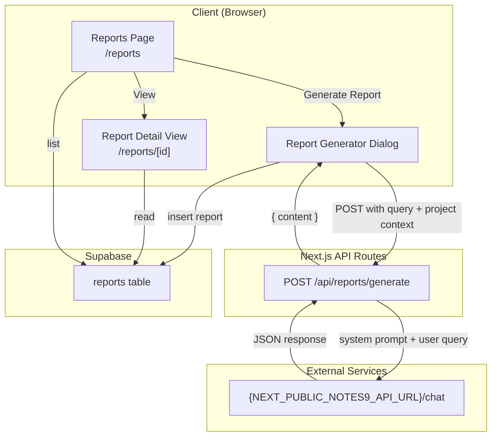

# Design Document: Reports Data Analysis

## Overview

This feature extends the existing Reports page (`/reports`) to support AI-powered data analysis report generation. Rather than building a new Biomni backend endpoint upfront, the initial implementation uses the existing Notes9 `/chat` API (via `NEXT_PUBLIC_NOTES9_API_URL`) with a custom data analysis system prompt — the same pattern used by the paper writing assistant (`app/api/ai/paper-chat/route.ts`). This lets us build the full frontend UI now and swap in a dedicated Biomni `/biomni/data_analysis` endpoint later.

Generated reports are persisted to the existing Supabase `reports` table (with two new columns: `content` and `references`). The API route is a single JSON request/response endpoint (no SSE streaming in this phase).

> **Future migration path:** When the Biomni `/biomni/data_analysis` backend is ready, replace the `/api/reports/generate/route.ts` internals to call the Biomni endpoint instead of `/chat`. The frontend UI, persistence layer, and detail view remain unchanged.

## Architecture



### Data Flow for Report Generation

1. User opens Report Generator dialog, selects project, optionally selects experiments, enters query describing the desired analysis
2. Client sends POST to `/api/reports/generate` with query, project context, and Bearer token
3. API route builds a data analysis system prompt (similar to `buildSystemPrompt()` in paper-chat), enriches the query with project/experiment context, and calls `{NEXT_PUBLIC_NOTES9_API_URL}/chat`
4. Notes9 `/chat` returns a JSON response with `{ content: string }` containing the generated report in markdown
5. API route returns the content to the client
6. Client inserts report row into Supabase `reports` table with content, status="draft", report_type="data_analysis"
7. User is navigated to `/reports/[id]` detail view

## Components and Interfaces

### New Files to Create

| File | Purpose |
|------|---------|
| `app/api/reports/generate/route.ts` | API route that calls Notes9 `/chat` with data analysis system prompt |
| `lib/report-agent-types.ts` | TypeScript types for report generation request/response |
| `app/(app)/reports/[id]/page.tsx` | Report detail view (server component) |
| `app/(app)/reports/report-generator-dialog.tsx` | Dialog for configuring and triggering report generation |
| `app/(app)/reports/[id]/report-detail-view.tsx` | Client component rendering report content |
| `app/(app)/reports/loading.tsx` | Skeleton loading state |
| `app/(app)/reports/error.tsx` | Error boundary with retry |

### Existing Files to Modify

| File | Change |
|------|--------|
| `app/(app)/reports/page.tsx` | Wire "Generate Report" button to dialog, pass projects/experiments for selection |
| `app/(app)/reports/reports-page-client.tsx` | Add `onClick` handler on report cards to navigate to `/reports/[id]`, wire "Generate Report" button |

### Component Interfaces

#### ReportGeneratorDialog

```typescript
interface ReportGeneratorDialogProps {
  open: boolean;
  onOpenChange: (open: boolean) => void;
  projects: { id: string; name: string }[];
  experiments: { id: string; name: string; project_id: string }[];
  userId: string;
}
```

Renders a dialog with:
- Project select (required)
- Experiment multi-select (optional, filtered by selected project)
- Query textarea (required) — e.g. "Analyze the trends in my cell viability data"
- Loading indicator while waiting for AI response
- Error display with retry
- On success: shows generated content preview before saving

#### ReportDetailView

```typescript
interface ReportDetailViewProps {
  report: ReportRow & { content: string | null };
}
```

Renders:
- Report metadata (title, status, type, dates, project, experiment, author)
- Markdown-rendered content (reuse existing `MarkdownRenderer` or `HtmlContent`)

#### useReportGeneration Hook

```typescript
interface ReportGenerationRequest {
  query: string;
  projectId: string;
  projectName: string;
  experimentIds?: string[];
  experimentNames?: string[];
}

interface ReportGenerationState {
  content: string | null;
  error: string | null;
  isGenerating: boolean;
}

interface UseReportGenerationReturn extends ReportGenerationState {
  generate: (request: ReportGenerationRequest, token: string) => Promise<{ content: string | null; error: string | null }>;
  reset: () => void;
}
```

Simple hook that:
- Calls `POST /api/reports/generate` with the query and project context
- Manages loading/error/content state
- Returns the generated markdown content on success
- No SSE streaming or clarification flows (those come later with Biomni)

### API Route Design

#### `/api/reports/generate/route.ts`

```typescript
export const maxDuration = 60;

const NOTES9_API_BASE = process.env.NEXT_PUBLIC_NOTES9_API_URL?.replace(/\/$/, '') || '';
const AI_SERVICE_URL = process.env.AI_SERVICE_URL?.replace(/\/$/, '') || '';
const AI_SERVICE_BEARER_TOKEN = process.env.AI_SERVICE_BEARER_TOKEN || '';
```

Follows the same pattern as `app/api/ai/paper-chat/route.ts`:

1. Validates Bearer token from Authorization header
2. Extracts `query`, `projectName`, `experimentNames` from request body
3. Builds a data analysis system prompt via `buildReportSystemPrompt()`:

```typescript
function buildReportSystemPrompt(opts: {
  projectName: string;
  experimentNames?: string[];
}): string {
  return `You are an expert scientific data analysis assistant. The user is a researcher who needs a data analysis report for their project.

PROJECT: ${opts.projectName}
${opts.experimentNames?.length ? `EXPERIMENTS: ${opts.experimentNames.join(', ')}` : ''}

Your capabilities:
- Analyze experimental data patterns and trends
- Generate statistical summaries and interpretations
- Identify significant findings and anomalies
- Suggest follow-up experiments based on results
- Present data in clear, structured report format

OUTPUT FORMAT:
Generate a structured data analysis report in markdown with these sections:
1. **Executive Summary** - Key findings in 2-3 sentences
2. **Data Overview** - Description of the dataset and methodology
3. **Analysis Results** - Detailed findings with subsections as needed
4. **Statistical Summary** - Key metrics and statistical tests
5. **Conclusions & Recommendations** - Interpretation and next steps

RULES:
1. Write in formal scientific tone
2. Be specific to the project and experiments mentioned
3. Use proper scientific terminology
4. Include quantitative observations where possible
5. Structure the report for easy scanning with headers and bullet points`;
}
```

4. Enriches the query: `${systemPrompt}\n\nUser request: ${query}`
5. Calls `{NEXT_PUBLIC_NOTES9_API_URL}/chat` (or falls back to `AI_SERVICE_URL/chat`) with:
```json
{
  "content": "<enriched query>",
  "history": [],
  "session_id": "report-<timestamp>"
}
```
6. Returns `{ content: string }` to the client

Validation:
- 401 if no Bearer token
- 400 if query is empty
- 400 if projectName is missing
- 503 if neither `NEXT_PUBLIC_NOTES9_API_URL` nor `AI_SERVICE_URL` is configured


## Data Models

### Report Types (`lib/report-agent-types.ts`)

```typescript
export type ReportGenerationRequest = {
  query: string;
  projectId: string;
  projectName: string;
  experimentIds?: string[];
  experimentNames?: string[];
};

export type ReportGenerationResponse = {
  content: string;
};
```

### Database Schema Changes

The existing `reports` table needs one new column:

```sql
ALTER TABLE reports ADD COLUMN content text;
```

- `content`: Stores the full markdown text of the generated report

The existing columns remain unchanged:
- `id` (uuid, PK)
- `title` (text)
- `status` (text) — values: "draft", "review", "final"
- `report_type` (text) — new value: "data_analysis"
- `created_at` (timestamptz)
- `project_id` (uuid, FK → projects)
- `experiment_id` (uuid, FK → experiments)
- `generated_by` (uuid, FK → profiles)

### Supabase Insert Shape (Client-Side)

```typescript
const insertPayload = {
  title: generatedTitle,       // extracted from first heading in content, or user-provided
  content: response.content,
  status: "draft",
  report_type: "data_analysis",
  project_id: selectedProjectId,
  experiment_id: selectedExperimentId ?? null,
  generated_by: userId,
};
```


## Correctness Properties

*A property is a characteristic or behavior that should hold true across all valid executions of a system — essentially, a formal statement about what the system should do. Properties serve as the bridge between human-readable specifications and machine-verifiable correctness guarantees.*

### Property 1: API route constructs correct upstream request

*For any* valid report generation request body containing a query, projectName, and optional experimentNames, the API route SHALL construct an upstream request to `{NEXT_PUBLIC_NOTES9_API_URL}/chat` that includes the data analysis system prompt with the project/experiment context embedded, and the user's query appended.

**Validates: Requirements 1.2, 3.5, 3.6**

### Property 2: Report persistence contains all required fields

*For any* valid report generation response and user context (userId, projectId, experimentId), the persisted report row SHALL contain the generated content, `status` set to `"draft"`, `report_type` set to `"data_analysis"`, and the correct `project_id`, `experiment_id`, and `generated_by` values.

**Validates: Requirements 1.5, 6.1, 6.2, 6.3**

### Property 3: API errors are surfaced to the user

*For any* error response from the Notes9 `/chat` endpoint, the API route SHALL return an error status and message, and the UI SHALL display the error with a retry option.

**Validates: Requirements 1.6**

### Property 4: Missing auth token returns 401

*For any* request to the reports API route that lacks a valid Bearer token in the Authorization header, the response SHALL have status 401 and a JSON body containing an error message.

**Validates: Requirements 3.3**

### Property 5: Missing API URL returns 503

*For any* request to the reports API route when neither `NEXT_PUBLIC_NOTES9_API_URL` nor `AI_SERVICE_URL` is configured, the response SHALL have status 503 and a JSON body containing a descriptive error message.

**Validates: Requirements 3.4**

### Property 6: Report detail displays all metadata fields

*For any* report object with non-null title, status, report_type, created_at, project, and experiment fields, the Report Detail View SHALL render all of these values in the output.

**Validates: Requirements 4.2**

### Property 7: Reports are listed in reverse chronological order

*For any* list of reports with distinct `created_at` timestamps, the displayed order SHALL be strictly descending by `created_at`.

**Validates: Requirements 5.1**

### Property 8: Multi-filter intersection

*For any* combination of filter values (project, experiment, status, type) and any list of reports, the filtered result SHALL contain exactly those reports that match ALL active (non-"all") filters simultaneously.

**Validates: Requirements 5.2**

### Property 9: Persistence failure retains generated content

*For any* report generation that completes successfully but where the Supabase insert fails, the generated content SHALL remain accessible in the UI (not discarded), and an error message SHALL be displayed.

**Validates: Requirements 6.4**

## Error Handling

| Scenario | Handling |
|----------|----------|
| No Bearer token | API route returns 401 JSON `{ error: "Authorization required..." }` |
| Empty query | API route returns 400 JSON `{ error: "query is required" }` |
| Missing projectName | API route returns 400 JSON `{ error: "projectName is required" }` |
| No AI service configured | API route returns 503 JSON `{ error: "No AI service configured..." }` |
| Upstream non-2xx | API route forwards upstream status and error message |
| Upstream unreachable | API route returns 502 JSON `{ error: "Failed to process request" }` |
| Generation error | UI shows error message with retry button in dialog |
| Supabase insert failure | UI shows error toast, retains generated content in dialog so user can retry save |
| Report not found (detail page) | Server component calls `notFound()`, Next.js renders 404 page |
| Page data load failure | `error.tsx` boundary shows error message with "Try again" button calling `reset()` |

## Testing Strategy

### Property-Based Testing

Library: **fast-check** (already available in the project's test ecosystem via vitest)

Each correctness property above maps to a single property-based test. Tests will be placed in `__tests__/properties/reports-data-analysis.property.test.ts`.

Configuration:
- Minimum 100 iterations per property test (`fc.assert(..., { numRuns: 100 })`)
- Each test tagged with a comment: `// Feature: reports-data-analysis, Property N: <title>`

Key generators needed:
- `arbReportRequest`: generates valid `ReportGenerationRequest` objects (random query strings, project names, optional experiment names)
- `arbReportResponse`: generates valid `ReportGenerationResponse` objects with random markdown content
- `arbReportRow`: generates report objects with all metadata fields for list/filter testing
- `arbFilterCombination`: generates filter value combinations (project, experiment, status, type)

### Unit Testing

Unit tests will be placed in `__tests__/unit/reports-data-analysis.test.ts` and cover:

- API route: specific example requests and expected upstream body construction (system prompt includes project name)
- API route: 401 response when token missing
- API route: 503 response when no AI service configured
- API route: 400 response when query empty or projectName missing
- Report detail: renders "not found" for non-existent report (from 4.5)
- Report list: empty state rendering when no reports exist (from 5.3)
- Report list: "no results" message when filters match nothing (from 5.4)
- Error boundary: renders error message and retry button (from 7.2)
- Generator dialog: opens with correct form fields on button click (from 1.1)
- Generator dialog: shows loading indicator during generation (from 7.4)
- Report detail: navigates to /reports/[id] on view click (from 4.1)
- Report detail: renders markdown content (from 4.3)

### Test Balance

Property tests handle the universal correctness guarantees (all valid inputs produce correct outputs). Unit tests handle specific examples, edge cases (empty states, not-found, missing config), and UI interaction verification. Together they provide comprehensive coverage without redundancy.
