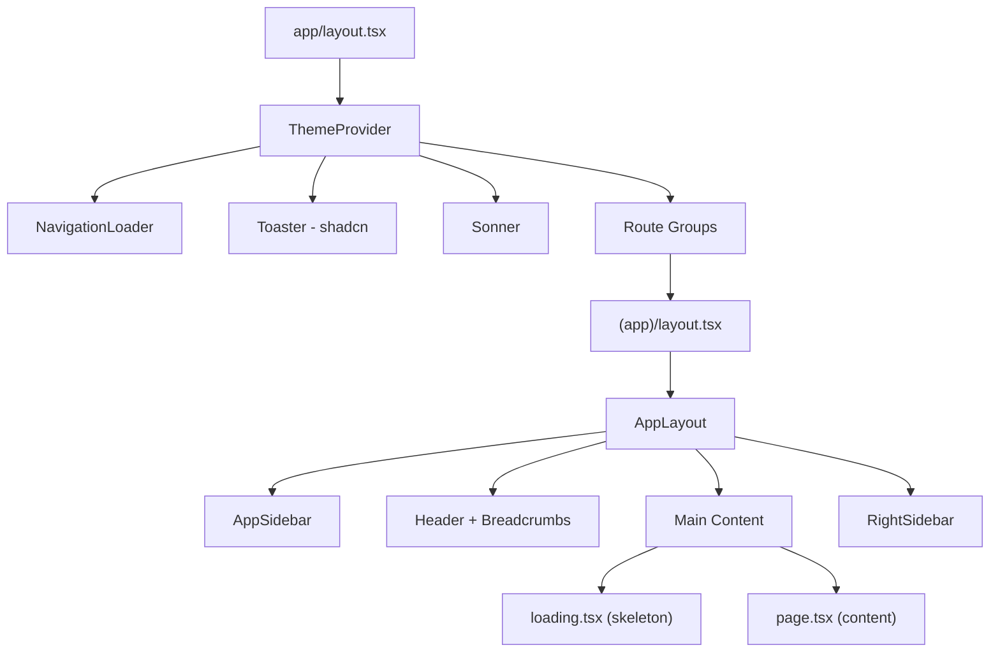

# Design Document: UX Journey Improvements

## Overview

This design addresses 15 UX improvement areas across the Notes9 research lab management application. The changes span the authenticated app shell (`AppLayout`), navigation loader (`NavigationLoader`), sidebar (`AppSidebar`), resource list pages, form pages, auth flow, dashboard, settings, and the toast notification system.

The improvements are primarily client-side, touching existing React components and Next.js page files. No new database tables or API routes are required. The changes focus on:

- Adding `loading.tsx` files for Next.js App Router streaming/skeleton support
- Hardening the `NavigationLoader` with safety timeouts and console warnings
- Adding error boundaries and retry mechanisms to the sidebar
- Standardizing empty states, grid/table toggles, and filter-no-match messages
- Improving breadcrumb accuracy for project-scoped pages
- Consolidating the dual toast system
- Fixing hydration-safe rendering for theme toggles and sidebar active states

## Architecture

The application uses Next.js App Router with three route groups:

```
app/
├── (app)/          # Authenticated routes, wrapped by AppLayout
├── (marketing)/    # Public marketing pages
├── (legal)/        # Legal pages (terms, privacy)
├── auth/           # Authentication pages (login, sign-up, etc.)
└── layout.tsx      # Root layout: ThemeProvider, NavigationLoader, Toaster, Sonner
```

### Key Architectural Decisions

1. **Skeleton loading via `loading.tsx` convention**: Next.js App Router automatically shows `loading.tsx` as a Suspense fallback during server component streaming. We add `loading.tsx` files to `(app)/dashboard/`, `(app)/experiments/`, `(app)/projects/`, `(app)/samples/`, `(app)/equipment/`, `(app)/protocols/`, `(app)/literature-reviews/`, and `(app)/papers/`. This is the idiomatic Next.js approach and requires zero changes to existing page components.

2. **NavigationLoader hardening in-place**: The existing `NavigationLoader` component at `components/navigation-loader.tsx` already has safety timeouts and marketing path exclusion. We refine it by adding console warnings on timeout, preventing activation on same-page clicks more robustly, and ensuring external/blank-target links are fully excluded.

3. **Sidebar error recovery via local state**: The `AppSidebar` at `components/layout/app-sidebar.tsx` already handles profile creation and real-time subscriptions. We add a visible retry button when project fetch fails and improve the skeleton loading state.

4. **Toast consolidation strategy**: Rather than removing one toast system, we standardize on Sonner (`toast()` from `sonner`) for all new toast calls and keep the shadcn `Toaster` for backward compatibility. Both remain in `app/layout.tsx`.



## Components and Interfaces

### 1. Skeleton Loading Components

New `loading.tsx` files for each major route:

| File Path | Skeleton Structure |
|---|---|
| `app/(app)/dashboard/loading.tsx` | Welcome section + quick actions card + 2-column grid (experiments + notes) + todo panel |
| `app/(app)/projects/loading.tsx` | Description + toggle row + 3-column card grid |
| `app/(app)/experiments/loading.tsx` | Description + toggle row + 3-column card grid |
| `app/(app)/samples/loading.tsx` | Description + toggle row + 4-column status cards + card grid |
| `app/(app)/equipment/loading.tsx` | Description + toggle row + 4-column status cards + card grid |
| `app/(app)/protocols/loading.tsx` | Description + toggle row + card grid |
| `app/(app)/lab-notes/loading.tsx` | Description + toggle row + filter row + card grid |
| `app/(app)/literature-reviews/loading.tsx` | Header + tabs skeleton |
| `app/(app)/papers/loading.tsx` | Description + button + tabs skeleton |

Each skeleton uses `<div className="animate-pulse">` with `bg-muted rounded-md` blocks matching the real page layout dimensions.

### 2. NavigationLoader Enhancements (`components/navigation-loader.tsx`)

Current behavior is mostly correct. Changes:

- **Console warning on safety timeout**: When `MAX_LOADER_DURATION_MS` fires, log `console.warn(\`[NavigationLoader] Safety timeout fired for route: ${destinationPath}\`)`.
- **Same-page click prevention**: Already handled via `isSamePage` check. Ensure query-string-only changes (e.g., `?tab=notes`) also count as same-page.
- **External link exclusion**: Already handled via `href.startsWith("/")` check. No change needed.
- **Marketing-to-marketing exclusion**: Already handled via `isMarketingPath()`. No change needed.

### 3. AppSidebar Error Recovery (`components/layout/app-sidebar.tsx`)

Current behavior: On fetch error, logs to console and shows toast. Changes:

- When `projectsError` occurs, set a `fetchError` state and render a retry button below "No active projects" text.
- The retry button calls `fetchData()` again.
- Skeleton loading already shows 3 `SidebarMenuSkeleton` items during `loading === true`.

### 4. Form Validation Improvements

**New Project Form** (`app/(app)/projects/new/page.tsx`):
- Already validates date order with `isEndDateBeforeStartDate()` and shows inline error.
- Already shows server errors via `getUniqueNameErrorMessage()`.
- Already disables submit button and shows "Creating..." during submission.
- Add: client-side validation message when name field is empty on blur (not just on submit via HTML `required`).

**Sign-Up Form** (`app/auth/sign-up/page.tsx`):
- Add debounced email existence check (500ms after typing stops) that shows inline warning with "Sign in with this email instead" link.

**Reset Password Form** (`app/auth/reset-password/page.tsx`):
- Already validates password mismatch with "Passwords do not match" error. No change needed.

### 5. Empty State Standardization

Current empty states are mostly consistent. Specific fixes:

| Page | Current Empty State | Required Change |
|---|---|---|
| Projects | ✅ "No projects yet" + "Create First Project" | None |
| Experiments | ✅ "No experiments yet" + "Create First Experiment" | None |
| Samples | ✅ "No samples recorded" + "Create First Sample" | None |
| Equipment | ✅ "No equipment registered" + "Create First Equipment" | None |
| Lab Notes | Uses `LabNotesList` component with no explicit empty state | Add empty state with icon + message + CTA |
| Papers | Uses `PaperList` component | Verify empty state has icon + message |
| Protocols | Check `ProtocolsPageContent` | Verify empty state consistency |

**Filter-no-match states**: Equipment and Samples already show "No equipment/samples match the selected filters." Lab Notes and Protocols need the same pattern.

### 6. Breadcrumb Improvements (`components/layout/app-layout.tsx`)

The `HeaderTitle` component already handles:
- ✅ Mobile scrollable breadcrumbs with gradient fade indicators
- ✅ Auto-scroll to rightmost segment
- ✅ Label truncation via `shortenLabel()` at 18 characters with `title` attribute

No structural changes needed. The breadcrumb accuracy depends on each page calling `SetPageBreadcrumb` correctly, which is already done for experiments, protocols, literature, and lab notes when project-scoped.

### 7. Grid/Table Toggle Consistency

All resource list pages already implement the same pattern:
- `useMediaQuery("(max-width: 768px)")` to detect mobile
- `useEffect` to force grid mode on mobile
- Toggle buttons with Grid/Table icons, table disabled on mobile

The toggle position is consistent (top-right of header row) across all pages. No structural changes needed.

### 8. Error Handling for Data Fetch Failures

| Page | Current Error Handling | Required Change |
|---|---|---|
| Lab Notes | ✅ Shows `Alert variant="destructive"` | None |
| Papers | ✅ Shows `Alert` with migration hint | None |
| Settings | Shows "Loading..." text indefinitely if profile fails | Add timeout or error state |
| Dashboard | No error handling for failed fetches (server component) | Add `error.tsx` boundary |
| Other server pages | No error handling | Add `error.tsx` boundaries |

### 9. Authentication Flow

| Scenario | Current Behavior | Required Change |
|---|---|---|
| Authenticated user visits `/` | ✅ Redirects to `/dashboard` | None |
| Unauthenticated user visits `/(app)` | ✅ Redirects to `/auth/login` | None |
| OAuth callback error | ✅ Redirects to `/auth/error` | None |
| Password reset success | ✅ Shows success + auto-redirect after 3s | None |
| Login with `email` param | ✅ Pre-fills email field | None |
| Sign-up existing email check | ❌ Not implemented | Add debounced check |

### 10. Dashboard Quick Actions

The dashboard at `app/(app)/dashboard/page.tsx` already implements:
- ✅ Quick action buttons for Create Project, Add Experiment, Record Sample
- ✅ Up to 3 recent experiments with name, project, assignee, status, progress
- ✅ Up to 3 recent notes with title, experiment, project, type, date
- ✅ "No recent experiments" / "No recent notes" fallback text
- ✅ TodoPanel with task management

No changes needed for Requirement 10.

### 11. Settings Theme Toggle

The settings page at `app/(app)/settings/page.tsx` already:
- ✅ Uses `mounted` state to defer theme button rendering
- ✅ Applies theme change immediately via `setTheme()`

The header theme toggle in `AppLayout` already:
- ✅ Uses `themeMounted` state with Moon fallback icon during SSR
- ✅ Switches to correct icon after mount

No changes needed for Requirement 11.

### 12. Project-Scoped Navigation

Already implemented across experiments, literature, and protocols pages:
- ✅ URL `?project=` parameter pre-filters content
- ✅ "Remove project filter" button shown when filter active
- ✅ Breadcrumbs show project name as clickable link

No changes needed for Requirement 12.

### 13. Accessible Interactive Elements

| Element | Current State | Required Change |
|---|---|---|
| Mobile menu button | ✅ `aria-label="Open navigation"` | None |
| Password visibility toggle | ✅ Dynamic `aria-label` | None |
| Grid/table toggle buttons | Buttons are focusable, but no explicit `aria-label` | Add `aria-label="Switch to grid view"` / `"Switch to table view"` |
| NavigationLoader overlay | ✅ `pointer-events: none` via className | None |
| Right sidebar Sheet | ✅ `<SheetTitle>` in `sr-only` | None |

### 14. Toast System Consolidation

Current state: Both `Toaster` (shadcn) and `Sonner` are rendered in `app/layout.tsx`. Different components use different toast systems:
- `AppSidebar` uses `toast` from `sonner`
- `Settings` page uses `useToast` from `@/hooks/use-toast` (shadcn)

Strategy: Keep both providers in root layout. Standardize new code on Sonner. Document the convention. Both already render in consistent positions.

### 15. Sidebar Active State

The `AppSidebar` already:
- ✅ Uses `mounted` state to prevent hydration mismatch
- ✅ Suppresses active styling for project-scoped deep links (`suppressActiveForProjectDeepLink`)
- ✅ Matches pathname for active state

No changes needed for Requirement 15.

## Data Models

No new database tables or schema changes are required. All improvements are client-side UI changes.

Existing data models referenced:
- `projects`: id, name, status, priority, start_date, end_date, created_by, organization_id
- `experiments`: id, name, status, project_id, assigned_to, progress
- `lab_notes`: id, title, note_type, experiment_id, project_id
- `samples`: id, sample_code, sample_type, status, experiment_id
- `equipment`: id, name, equipment_code, category, status, location
- `protocols`: id, name, is_active
- `papers`: id, title, created_by, project_id
- `profiles`: id, email, first_name, last_name, role, organization_id, avatar_url
- `dashboard_tasks`: id, user_id, completed, due_at


## Correctness Properties

*A property is a characteristic or behavior that should hold true across all valid executions of a system — essentially, a formal statement about what the system should do. Properties serve as the bridge between human-readable specifications and machine-verifiable correctness guarantees.*

### Property 1: Navigation loader dismisses on pathname change

*For any* active NavigationLoader and any new pathname detected by the `usePathname()` hook, the loader should dismiss within `MIN_LOADER_DURATION_MS` (350ms) of the pathname change, never remaining visible indefinitely.

**Validates: Requirements 2.1**

### Property 2: Same-page clicks do not trigger navigation loader

*For any* current pathname and any link `href` that resolves to the same pathname (ignoring query strings and hash fragments), clicking that link should not activate the NavigationLoader.

**Validates: Requirements 2.3**

### Property 3: External and blank-target links do not trigger navigation loader

*For any* link element with `target="_blank"` or any `href` that does not start with `/`, clicking that link should not activate the NavigationLoader.

**Validates: Requirements 2.4**

### Property 4: Marketing-to-marketing navigation does not trigger loader

*For any* two paths where both are identified as marketing paths by `isMarketingPath()`, navigating between them should not activate the NavigationLoader.

**Validates: Requirements 2.5**

### Property 5: Date order validation rejects invalid date pairs

*For any* pair of date strings where the end date is chronologically before the start date, the `isEndDateBeforeStartDate()` function should return `true`, and the form should display the `DATE_ORDER_ERROR` message.

**Validates: Requirements 4.2**

### Property 6: Password mismatch validation

*For any* two distinct password strings submitted on the reset password form, the form should display "Passwords do not match" and prevent submission.

**Validates: Requirements 4.6**

### Property 7: Empty state rendering for zero-item resource lists

*For any* Resource_List_Page component (Projects, Experiments, Samples, Equipment, Lab Notes, Papers, Protocols) rendered with an empty data array, the component should render an empty state containing a descriptive message and a primary call-to-action button linking to the creation page.

**Validates: Requirements 5.1**

### Property 8: Filter-no-match message distinct from empty state

*For any* Resource_List_Page with non-empty source data but active filters that exclude all items, the page should display a filter-specific "no matches" message that is textually distinct from the zero-data empty state message.

**Validates: Requirements 5.6**

### Property 9: Breadcrumb accuracy for experiment pages

*For any* experiment detail page, if the experiment belongs to a project and the page is accessed with project context, the breadcrumb should display `[Project Name] > [Experiment Name]`. If accessed without project context, the breadcrumb should display the experiment name with appropriate parent segments.

**Validates: Requirements 6.1, 6.2**

### Property 10: Breadcrumb label truncation on mobile

*For any* breadcrumb label string longer than 18 characters, the `shortenLabel()` function should return a string of exactly 18 characters ending with "…", and the original full label should be preserved in the `title` attribute.

**Validates: Requirements 6.5**

### Property 11: Mobile viewport forces grid view

*For any* Resource_List_Page component, when the viewport width is 768px or less (isMobile is true), the view mode should be locked to "grid" and the table toggle button should be disabled.

**Validates: Requirements 7.1, 7.2**

### Property 12: Fetch error displays destructive alert

*For any* Resource_List_Page (Lab Notes, Papers, or any client-fetched list) that encounters a data fetch error, the page should render an `Alert` component with `variant="destructive"` containing the error message.

**Validates: Requirements 8.1, 8.2, 8.4**

### Property 13: Unauthenticated access redirects to login

*For any* route under the `(app)` route group, if the user is not authenticated, the server component should redirect to `/auth/login`.

**Validates: Requirements 9.2**

### Property 14: Login email pre-fill from query parameter

*For any* email string passed as the `email` query parameter to the login page, the email input field should be pre-filled with that exact value.

**Validates: Requirements 9.5**

### Property 15: Dashboard recent items capped at 3

*For any* list of recent experiments or recent lab notes returned from the database, the dashboard should render at most 3 items, regardless of how many are available.

**Validates: Requirements 10.2, 10.3**

### Property 16: Project URL parameter pre-filters resource pages

*For any* resource page (Experiments, Literature, Protocols) that receives a valid `project` URL parameter, the page should pre-filter its content to show only items belonging to that project.

**Validates: Requirements 12.1, 12.2, 12.3**

### Property 17: Active project filter shows remove button

*For any* Resource_List_Page with an active project filter via URL parameter, the page should render a "Remove project filter" button that, when clicked, clears the filter and shows all items.

**Validates: Requirements 12.4**

### Property 18: Project-scoped breadcrumb includes project link

*For any* page with an active project filter, the breadcrumb bar should include the project name as a clickable link pointing to `/projects/{projectId}`.

**Validates: Requirements 12.5**

### Property 19: Sidebar active state matches current pathname

*For any* navigation item in the sidebar and any current pathname, the item should be marked as active if and only if the pathname equals the item's href or starts with `{href}/`, and the URL does not contain a `project` query parameter for experiment/literature/protocol routes.

**Validates: Requirements 15.1, 15.2**

## Error Handling

### Navigation Loader Errors

- **Safety timeout**: If the NavigationLoader exceeds `MAX_LOADER_DURATION_MS` (8s standard, 12s auth), it auto-dismisses and logs `console.warn("[NavigationLoader] Safety timeout fired for route: {path}")`.
- **No crash on missing pathname**: The loader checks `pathname` is non-null before comparisons.

### Sidebar Data Fetch Errors

- **Supabase client not initialized**: Shows toast error "Database connection error" and sets `loading = false`.
- **Auth error**: Shows toast "Authentication error. Please try logging in again."
- **Profile not found**: Attempts auto-creation of profile and organization. On failure, shows toast with specific error.
- **Projects fetch error**: Shows toast with error message, sets `projects = []`, and renders "No active projects" with a retry button.
- **Real-time subscription failure**: Silently fails; sidebar still shows data from initial fetch.

### Form Submission Errors

- **New Project**: Catches insert errors, passes through `getUniqueNameErrorMessage()` for duplicate name detection, displays in inline error banner.
- **Settings Profile**: Catches update errors, shows destructive toast with error message.
- **Auth Forms**: Catches Supabase auth errors, displays inline error messages with contextual guidance (e.g., "Wrong email or password").

### Page-Level Error Boundaries

- Add `error.tsx` files to `(app)/dashboard/`, `(app)/experiments/`, `(app)/projects/`, and other server-rendered routes to catch unhandled errors and display a retry UI instead of a blank page.

### Data Fetch Failures on Client Pages

- Lab Notes: Already shows `Alert variant="destructive"` with error message.
- Papers: Already shows `Alert` with migration hint.
- Settings: Add a timeout (10s) to the profile loading state that transitions to an error message if the fetch hasn't completed.

## Testing Strategy

### Testing Framework

- **Unit/Example Tests**: Vitest with React Testing Library (`@testing-library/react`)
- **Property-Based Tests**: `fast-check` library for property-based testing with Vitest
- **Minimum iterations**: 100 per property test

### Unit Tests (Examples and Edge Cases)

Unit tests cover specific scenarios from the acceptance criteria that are not properties:

1. **Skeleton loading components**: Verify each `loading.tsx` renders expected structure (example tests for Req 1.1-1.3)
2. **NavigationLoader safety timeout values**: Verify 8000ms for standard, 12000ms for auth (Req 2.2)
3. **Console warning on timeout**: Verify `console.warn` is called when safety timeout fires (Req 2.6)
4. **Sidebar skeleton during loading**: Verify 3 `SidebarMenuSkeleton` items render when `loading=true` (Req 3.1)
5. **Sidebar retry on error**: Verify retry button appears on fetch error (Req 3.2)
6. **Specific empty state messages**: Verify exact text for each resource type (Req 5.2-5.5)
7. **Auth error page**: Verify error code and description display (Req 9.3)
8. **Password reset success redirect**: Verify 3-second auto-redirect (Req 9.4)
9. **Dashboard quick actions**: Verify 3 buttons render (Req 10.1)
10. **Theme toggle hydration safety**: Verify `mounted` guard prevents SSR mismatch (Req 11.1-11.3)
11. **Accessibility attributes**: Verify `aria-label` values on interactive elements (Req 13.1-13.5)
12. **Toast providers in root layout**: Verify both Toaster and Sonner render (Req 14.1)

### Property-Based Tests

Each property test uses `fast-check` with minimum 100 iterations and references the design property:

```typescript
// Feature: ux-journey-improvements, Property 2: Same-page clicks do not trigger navigation loader
test.prop([fc.string()], { numRuns: 100 }, (pathname) => {
  // ... test that same-page detection works for any pathname
})
```

Property tests to implement:

1. **Property 1**: Generate random pathnames, simulate pathname change, verify loader dismisses
2. **Property 2**: Generate random pathnames, verify `isSamePage` detection with query/hash variations
3. **Property 3**: Generate random hrefs with `target="_blank"` or external URLs, verify no activation
4. **Property 4**: Generate pairs of marketing paths, verify `isMarketingPath()` returns true for both
5. **Property 5**: Generate random date pairs where end < start, verify `isEndDateBeforeStartDate()` returns true
6. **Property 6**: Generate pairs of distinct strings, verify mismatch detection
7. **Property 7**: Generate empty arrays, verify empty state components render CTA
8. **Property 8**: Generate non-empty arrays with filters that exclude all, verify filter message
9. **Property 9**: Generate project/experiment name pairs, verify breadcrumb segments
10. **Property 10**: Generate strings > 18 chars, verify `shortenLabel()` output
11. **Property 11**: Simulate mobile viewport, verify grid mode is forced
12. **Property 12**: Generate error messages, verify Alert renders with destructive variant
13. **Property 13**: Generate (app) route paths, verify redirect for unauthenticated users
14. **Property 14**: Generate email strings, verify pre-fill behavior
15. **Property 15**: Generate experiment/note lists of varying lengths, verify max 3 rendered
16. **Property 16**: Generate project IDs, verify pre-filter behavior
17. **Property 17**: Generate project filter states, verify remove button presence
18. **Property 18**: Generate project names/IDs, verify breadcrumb link
19. **Property 19**: Generate pathname/nav-item pairs, verify active state logic

### Test File Organization

```
__tests__/
├── properties/
│   ├── navigation-loader.property.test.ts
│   ├── form-validation.property.test.ts
│   ├── empty-states.property.test.ts
│   ├── breadcrumbs.property.test.ts
│   ├── sidebar-active-state.property.test.ts
│   ├── project-scoping.property.test.ts
│   ├── dashboard-limits.property.test.ts
│   └── auth-flow.property.test.ts
├── unit/
│   ├── loading-skeletons.test.tsx
│   ├── navigation-loader.test.tsx
│   ├── sidebar-error-recovery.test.tsx
│   ├── empty-states.test.tsx
│   ├── auth-pages.test.tsx
│   ├── settings-hydration.test.tsx
│   └── accessibility.test.tsx
```
