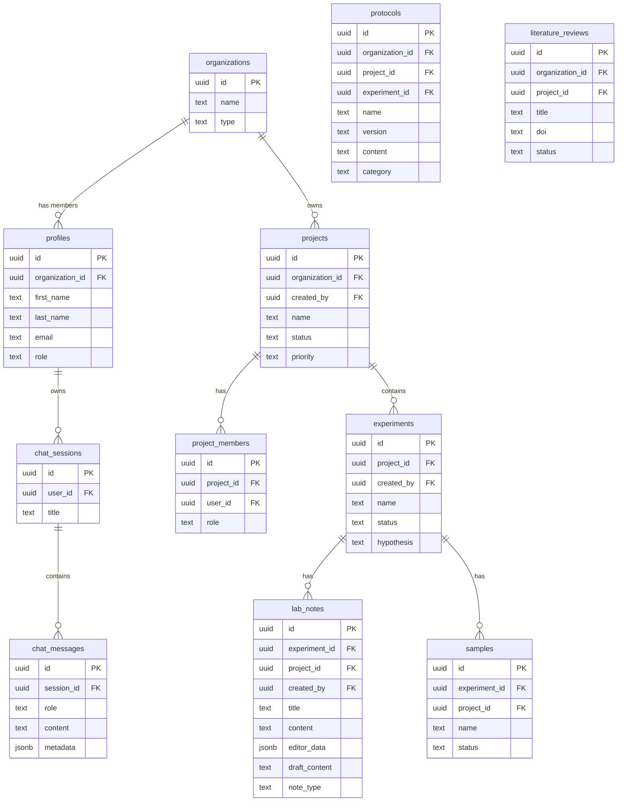

# Data Model

All schema is derived from `scripts/000_full_script.sql` (the canonical baseline). Incremental migrations in `scripts/0XX_*.sql` extend it. Always read both before writing migrations.

---

## Core Entity Hierarchy

```
Organization
  └── Profile (user, belongs to one org)
  └── Org Role / Org Member (RBAC within org)
  └── Project
        └── Project Member (lead / member / observer)
        └── Experiment
              └── Lab Note
              └── Sample
              └── Protocol (via experiment_protocols join)
              └── Experiment Data (files)
              └── Experiment Steps
              └── Equipment Usage
              └── Assay (via experiment_assays join)
              └── Quality Control
        └── Protocol (org-scoped, reusable)
        └── Literature Review (paper)
        └── Report
  └── Equipment (org-scoped)
  └── Assay definition (org-scoped)
```

---

## ER Diagram (core entities)



---

## Table Reference

### Core identity tables

| Table | Purpose |
|-------|---------|
| `organizations` | Top-level tenant. Each user belongs to exactly one org. |
| `profiles` | User profile. FK to `auth.users` (Supabase Auth). Carries `organization_id`. |
| `org_roles` | Named roles within an org (system + custom). |
| `org_members` | Join table: user ↔ org with assigned role. |
| `org_permissions` / `org_role_permissions` | Fine-grained permission RBAC (resource × action). |
| `org_invitations` | Pending/sent org member invitations with expiry tokens. |

### Research hierarchy

| Table | Purpose |
|-------|---------|
| `projects` | Top-level research container. Org-scoped. Status: planning / active / on_hold / completed / cancelled. |
| `project_members` | Project membership (lead / member / observer). |
| `experiments` | An experiment within a project. Status: planned / in_progress / data_ready / analyzed / completed / cancelled. |
| `experiment_steps` | Ordered procedural steps within an experiment. |
| `protocols` | Standard Operating Procedures. Org-scoped, versioned, reusable. Can be linked to project or experiment. |
| `experiment_protocols` | Join: experiment ↔ protocol. |
| `assays` | Assay definitions. Org-scoped. |
| `experiment_assays` | Join: experiment ↔ assay with parameters. |

### Lab notes

| Table | Purpose |
|-------|---------|
| `lab_notes` | Rich text notes. Holds Tiptap JSON in `editor_data` (JSONB). Draft/commit model: `draft_content` (autosave) → `content` (committed). `note_type`: observation / analysis / conclusion / general. |
| `lab_note_protocols` | Join: lab note ↔ protocol. |
| `document_versions` | Immutable audit trail for lab note and protocol edits. Records content hash, diff stats, and author info. |
| `content_diffs` | Detailed word-level diff segments for change display. |

### Data files

| Table | Purpose |
|-------|---------|
| `experiment_data` | Files attached to experiments (raw / processed / analysis / visualization). Stores `file_url`, `file_type`, `file_size`. Carries `workbook_snapshot` for spreadsheet previews. |
| `experiment_data_entity_links` | Link an experiment data file to other entity types. |

### Samples and equipment

| Table | Purpose |
|-------|---------|
| `samples` | Biological/chemical samples. Scoped to experiment and/or project. |
| `equipment` | Lab equipment (org-scoped). Status: available / in_use / maintenance / offline. |
| `equipment_usage` | Usage log: equipment ↔ experiment ↔ user + time range. |
| `equipment_maintenance` | Maintenance records per equipment item. |
| `quality_control` | QC records tied to experiments. |

### Literature

| Table | Purpose |
|-------|---------|
| `literature_reviews` | Research papers. Carries full bibliographic metadata (DOI, PMID, authors, etc.), PDF storage path, and AI-generated summaries (`ai_methods_summary`, `ai_results_summary`). |
| `literature_pdf_annotations` | Highlights and comments on literature PDFs (page-level, with rects for positioning). |
| `literature_search_telemetry` | Per-search performance telemetry (token counts, cache hits, result counts). |

### Chat / Catalyst AI

| Table | Purpose |
|-------|---------|
| `chat_sessions` | One conversation thread per user. Carries optional `protocol_id` for protocol-context sessions. |
| `chat_messages` | Individual messages (user / assistant / system). Rich `metadata` JSONB field carries citations, grounding, artifacts, etc. |
| `chat_memories` | Episodic memories extracted from sessions (typed: assay_result / hypothesis / etc.). Vector embedding for semantic recall. |
| `chat_episode_summaries` | Rolling summaries of past chat episodes (with vector embedding) for long-session context compression. |
| `chat_researcher_profiles` | Aggregate researcher profile: focus areas, active targets, open questions. Updated per session. |
| `message_votes` | Thumbs up/down on assistant messages. |

### Agent telemetry

| Table | Purpose |
|-------|---------|
| `agent_sessions` | Agent session (different from chat sessions — scoped to `paper_analyzer` / `biomni` agent types). |
| `agent_runs` | Per-query agent run record. Captures all telemetry: tokens, cost, tool calls, confidence, latency. |
| `agent_llm_calls` | Individual LLM API calls within a run. |
| `agent_tool_calls` | Individual tool invocations within a run. |
| `agent_trace_events` | Raw SSE trace events logged for debugging. |
| `agent_messages` | Messages within an agent session. |

### Misc

| Table | Purpose |
|-------|---------|
| `papers` | Collaborative papers/reports authored in-app (Tiptap + Yjs). Separate from `literature_reviews`. |
| `paper_yjs_documents` | Yjs CRDT state for collaborative paper editing. |
| `reports` | Generated reports (linked to project). |
| `calendar_events` | User-scoped calendar entries with project/experiment context. |
| `dashboard_tasks` | Personal TODO tasks on the dashboard. |
| `audit_log` | System-level audit log (create/update/delete per table). |
| `chunk_jobs` | Async queue for embedding chunk jobs (create/update/delete operations on embeddable records). |
| `mcp_servers` | User-configured MCP server endpoints (for future agent tool integrations). |
| `usage_events` | Product telemetry events (feature usage, session metrics). |

---

## RLS Scoping Model

Every table with user data has Row Level Security enabled. The model is:

1. **Org-scoped** (most tables): a row is visible to any authenticated user whose `profiles.organization_id` matches the row's `organization_id`.
2. **Project-scoped** (experiments, lab_notes, etc.): the user must be a member of the row's `project_id` via `project_members`.
3. **User-scoped** (chat_sessions, dashboard_tasks, etc.): only the row owner can see/modify it.

The agent bypasses RLS when writing its own telemetry rows using the `service_role` key.

See `docs/row-level-security-policies.md` for the full policy listing, and `docs/rls-quick-reference.md` for diagnostic SQL.

> **Critical:** A prior incident where nested `SELECT` in RLS policies caused infinite recursion (`42P17`) on `projects`. Always test new policies against `scripts/000_full_script.sql` before applying, and prefer set-returning helper functions over inline subqueries that reference the same table.
