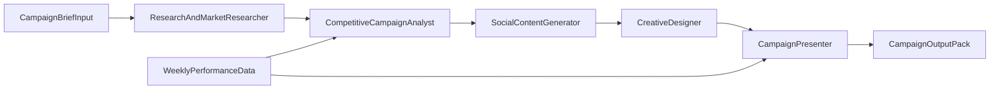

# Notes9 Agentic Marketing Workflow

This workflow defines a multi-agent campaign system for Notes9 across Reddit and LinkedIn.

## Objective

- Build a repeatable campaign process from research to presentation.
- Keep claims evidence-based and compliant.
- Produce weekly output packs that are easy to review and approve.

## Agent Roles

1. **ResearchAndMarketResearcher**
   - Collect audience insights, pain points, and language patterns.
   - Map subreddits, LinkedIn segments, and trend signals.
2. **CompetitiveCampaignAnalyst**
   - Analyze similar tools and visible campaign patterns.
   - Extract positioning gaps, hooks, and channel tactics.
3. **SocialContentGenerator**
   - Produce Reddit and LinkedIn post variants from approved inputs.
   - Adapt tone, CTA strength, and format by platform.
4. **CreativeDesigner**
   - Convert approved post directions into visual concepts and asset briefs.
   - Ensure visual consistency with Notes9 messaging.
5. **CampaignPresenter**
   - Consolidate strategy, outputs, and rationale into a decision-ready pack.
   - Provide launch checklist and KPI tracking setup.

## Pipeline

## Required Inputs

Start every cycle with `templates/campaign-brief.md` filled in.

Required fields:

- ICP and target lab profile
- Campaign goal and primary CTA
- Core value proposition and proof points
- Claim guardrails (what we can and cannot claim)
- Channel mix and posting cadence
- Region/language constraints

## Platform Logic

### Reddit

- Problem-first hooks and educational framing.
- Community-fit checks before drafting.
- Soft CTA (resource, discussion, demo link only when context fits).
- Keep language practical and non-promotional.

### LinkedIn

- Authority-first POV (founder/team/research workflow narrative).
- Stronger B2B CTA aligned to business outcome.
- Produce single-post + carousel/thread variants.
- Keep proof and outcomes explicit and scannable.

## Handoff Contracts

Each agent must produce an output artifact before the next step starts.

- Researcher -> `research-findings.md`
- Competitive Analyst -> `competitor-analysis.md`
- Content Generator -> `social-drafts.md`
- Creative Designer -> `creative-brief.md`
- Campaign Presenter -> `campaign-pack.md`

Each artifact must include:

- Assumptions
- Source references
- Open risks
- Revision notes

## Compliance and Quality Gates

- No unverified technical or clinical claims.
- No comparative claims without evidence in cited sources.
- No medical overclaiming language.
- Competitor references must include public source links.
- Every post must pass tone and channel-fit checks.

## Quick Start (Execution Order)

1. Fill `templates/campaign-brief.md`.
2. Run market research and save `research-findings.md`.
3. Run competitor analysis using `templates/competitor-analysis.md`.
4. Generate social drafts for both channels.
5. Produce creative direction for selected drafts.
6. Compile final deck/report with presenter agent.
7. Track performance using `templates/weekly-campaign-report.md`.

## Expected Output Pack

- Campaign brief
- Audience and market research summary
- Competitor campaign analysis
- Reddit draft set (3-5 variants)
- LinkedIn draft set (3-5 variants)
- Creative design brief and asset checklist
- Final campaign presentation with KPIs and next actions

## Launch in 1 Session Runbook

1. Confirm goal, CTA, and claim guardrails.
2. Generate research and competitor insights.
3. Produce first content batch for both channels.
4. Select top variants and create creative instructions.
5. Build presenter summary and approve launch set.
6. Schedule publication and define week-1 metrics.
